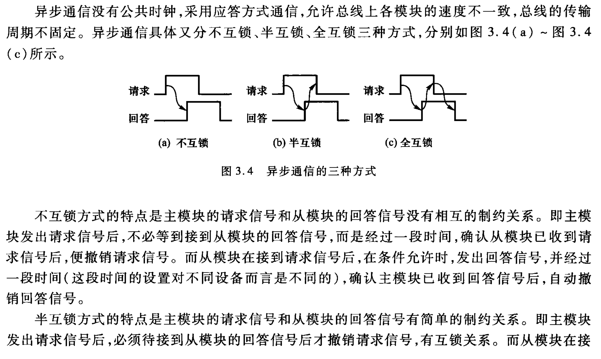
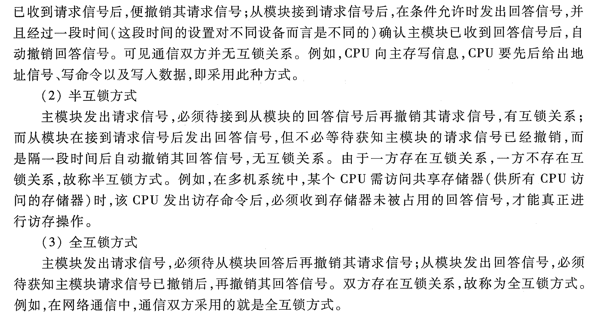

# 总线通信控制 (ch03-07-tang3-p66)

> 3.6 试比较同步通信和异步通信
> **3.7 画图说明异步通信中请求与回答有哪几种互锁关系。**

## 总线通信控制 (3.4.3.4-tang2psets-p37p39)

> 什么是总线通信控制？为什么需要总线通信控制？

总线通信主要解决通信双方如何获知传输开始和传输结束，以及通信双方如何协调配合。因为总线是众多部件共享的，在传送时间上只能用分时方式来解决，所以通信双方必须按某种约定的方式进行通信。

- 总线通信控制
	- 同步通信
	- **异步通信**
		- **应答方式**
			- **不互锁**
			- **半互锁**
			- **全互锁**
	- 半同步通信

## 异步通信 vs. 同步通信 (3.4.3.6-tang2psets-p37p40)

> 异步通信与同步通信的主要区别是什么？说明通信双方如何联络。

同步通信和异步通信的主要区别是前者有公共时钟，总线上的所有设备按统一的时序、统一的传输周期来进行信息传输，通信双方按约定好的时序联络；后者没有公共时钟，没有固定的传输周期，采用应答方式通信，具体的联络方式有不互锁、半互锁和全互锁三种。不互锁方式通信双方没有相互制约关系；半互锁方式通信双方有简单的制约关系；全互锁方式通信双方有完全的制约关系。其中全互锁通信可靠性最高。

## 异步通信

### tang2psets

### tang3

