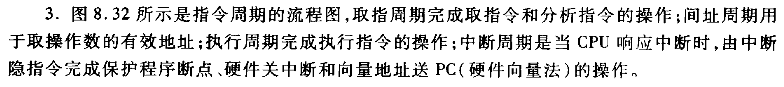

# 指令周期 (ch08-03-tang3-p370) (8.4.3.3-tang2psets-p268p273)

> 画出指令周期的流程图，分别说明图中每个子周期的作用。

图 8.32 所示是指令周期的流程图：

- **取指周期**：完成取指令和分析指令的操作；
    
- **间址周期**：用于取操作数的有效地址；
    
- **执行周期**：完成执行指令的操作；
    
- **中断周期**：当 CPU 响应中断时，由中断隐指令完成保护程序断点、硬件关中断和向量地址送 PC（硬件向量法）的操作。

- [InstructionCycle-tang3.pdf](assets/InstructionCycle-tang3.pdf)

