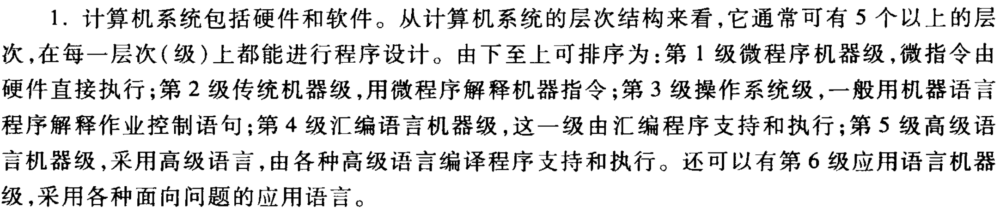
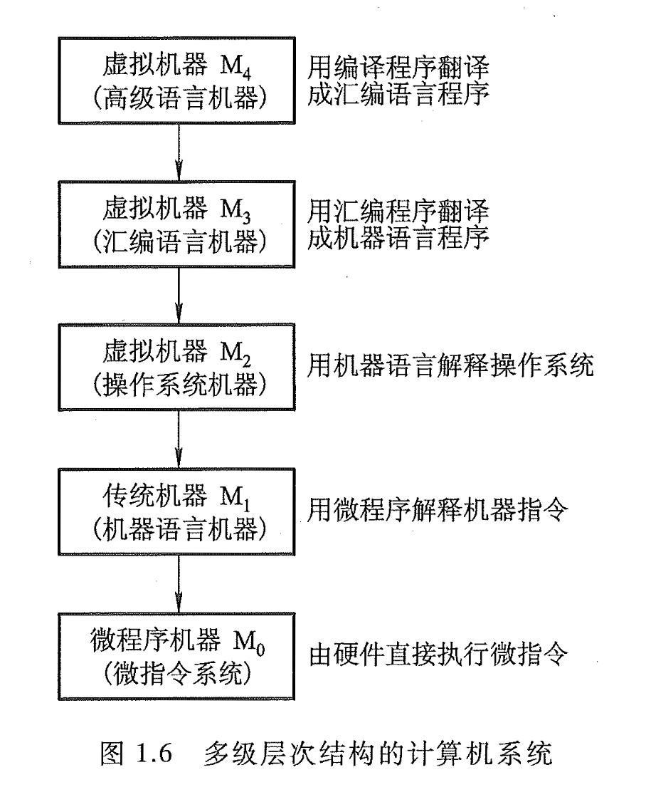
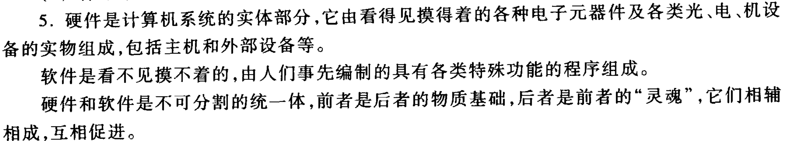

# 计算机系统

> 什么是**计算机系统**、计算机**硬件**和计算机**软件**？硬件和软件哪个更重要？
> 
> —— ch01-01-tang3-p19

---

- **计算机系统**：包括**硬件**、**软件**。
	- **硬件**：计算机系统的实体，由看得见、摸得着的各种电子元器件，各类光、电、机设备的实物组成，如主机、外设等。
	- **软件**：看不见、摸不着，由人们事先编制的具有各种特殊功能的信息组成。它是用来充分发挥硬件性能，提高机器工作效率，指挥硬件工作的程序、文档、数据的集合。
- 硬件、软件**同等重要**。因为它们在计算机系统中相辅相成，相互依存，互相促进，缺一不可，是不可分割的统一体。
	- 硬件是软件的物质基础；
	- 软件是硬件的“灵魂”。

## 计算机系统

> 什么是计算机系统？说明计算机系统的层次结构。
> 
> —— 1.4.3.1-tang2psets-p11p13

---

**计算机系统包括硬件和软件。**

从计算机系统的层次结构来看，它通常可有 5 个以上的层次，在每一层次（级）上都能进行程序设计。

由下至上可排序为：

- 第 1 级 微程序机器级，微指令由硬件直接执行；
    
- 第 2 级 传统机器级，用微程序解释机器指令；
    
- 第 3 级 操作系统级，一般用机器语言程序解释作业控制语句；
    
- 第 4 级 汇编语言机器级，这一级由汇编程序支持和执行；
    
- 第 5 级 高级语言机器级，采用高级语言，由各种高级语言编译程序支持和执行。
    

还可以有：

- 第 6 级 应用语言机器级，采用各种面向问题的应用语言。

## 硬件、软件

> 什么是硬件？什么是软件？两者谁更重要？为什么？
> 
> ——1.4.3.5-tang2psets-p11p14

---

- 硬件是计算机系统的实体部分，它由看得见摸得着的各种电子元器件及各类光、电、机设备的实物组成，包括主机和外部设备等。
- 软件是看不见摸不着的，由人们事先编制的具有各类特殊功能的程序组成。
- 硬件和软件是不可分割的统一体，前者是后者的物质基础，后者是前者的“灵魂”，它们相辅相成，互相促进。
