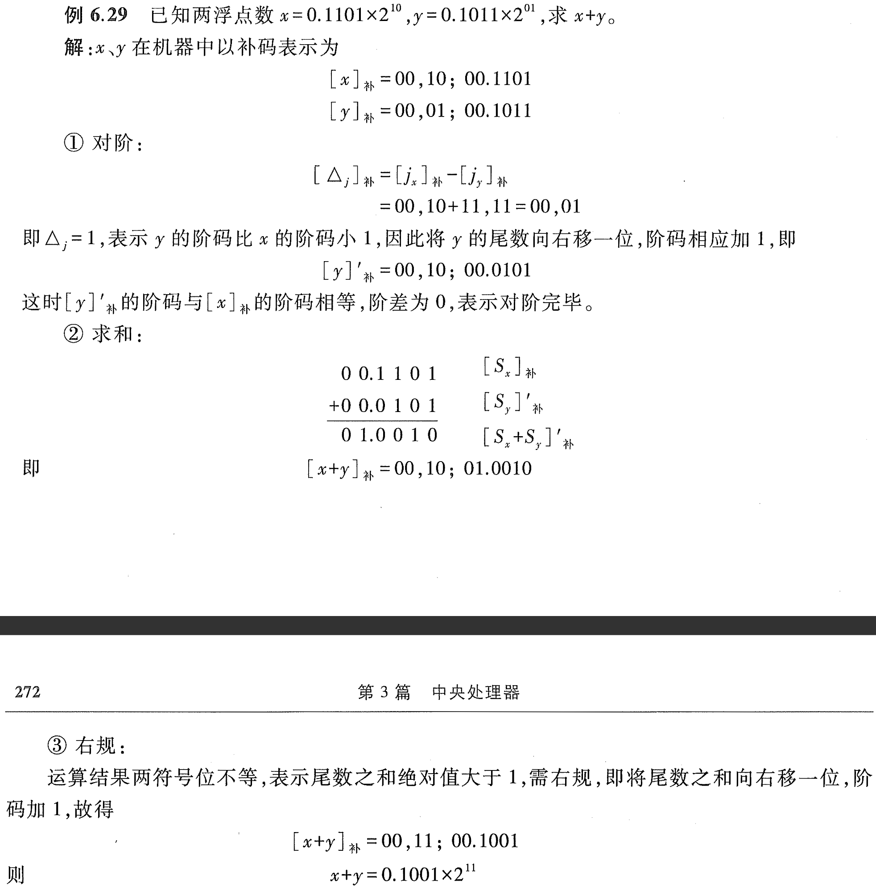

# e6.29-tang3-p271

## sol

$$
数符.尾数的数值部分^{阶符-阶码的数值部分}
$$

1. 写出浮点数在机器中的补码表示
2. **对阶**（小阶向大阶看齐）：首先求出阶差，然后让小阶向大阶看齐，对阶。
3. 尾数求和
4. **规格化**

运算结果，如果数符的两个符号位不等，则表示尾数之和的绝对值大于1，需要右规。
所谓右规，就是将尾数之和向右移动一位，然后阶码加1。