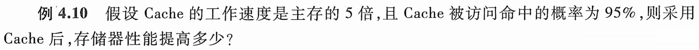

# e4.10-tang3-p121

## key

## sol

Cache的工作速度是主存的5倍，即主存的存取周期是Cache的5倍。

$$
t_m=5t_c
$$
$$
h_c=95\%
$$
$$
t_a=h_ct_c+(1-h_c)t_m=0.95\times t_c+0.05\times5t_c=1.2t_c
$$

$$
p=\frac{t_m}{t_a}=\frac{5t_c}{1.2t_c}\approx4.17
$$

