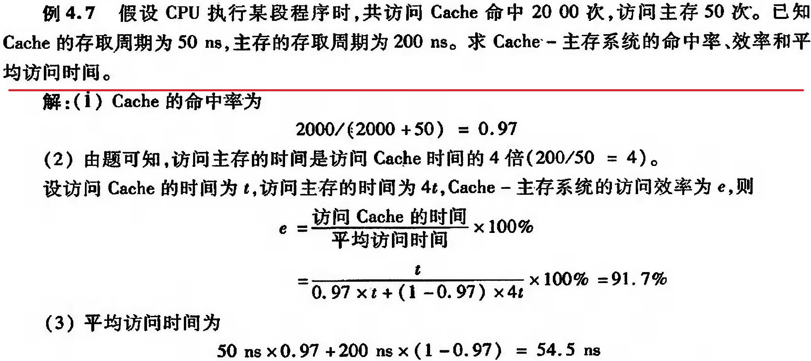

# e4.7-tang3-p111

## sol

1) $h$

$$
h=\frac{n_c}{n_c+n_m}=\frac{2000}{2000+50}\approx0.97560976\approx0.97
$$

2) $t_a$

$$
t_a=ht_c+(1-h)t_m=0.97\times50\text{ns}+(1-0.97)\times200\text{ns}=54.5\text{ns}
$$

3) e

0.91743119

$$
e=\frac{t_c}{t_a}\times100\%=\frac{50}{54.5}\times100\%\approx91.7\%
$$