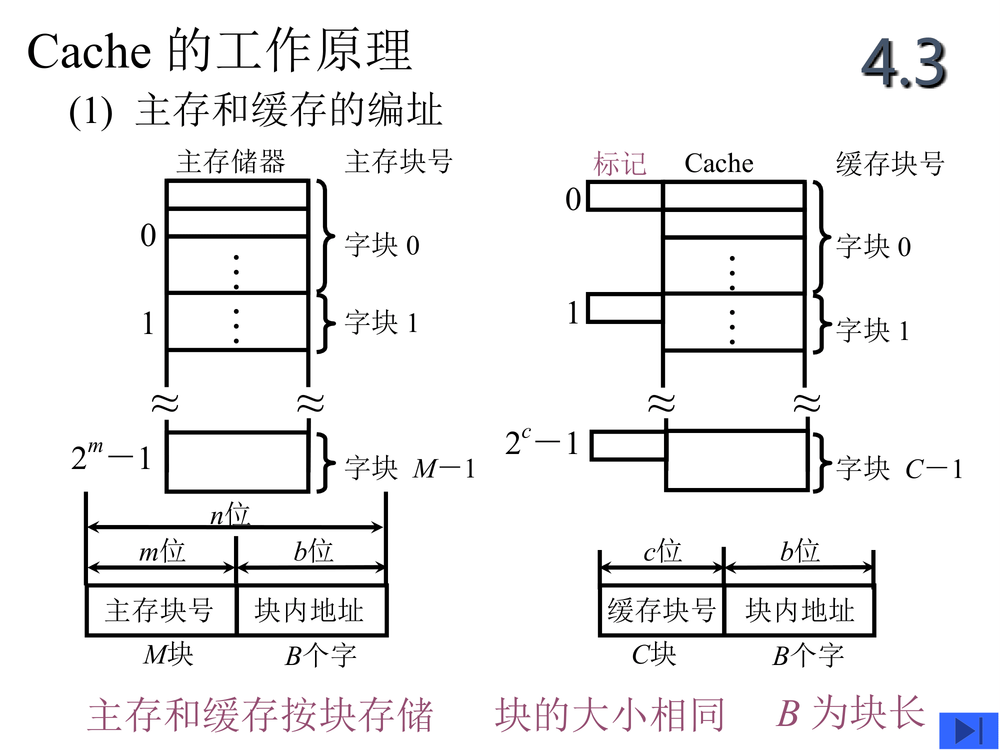
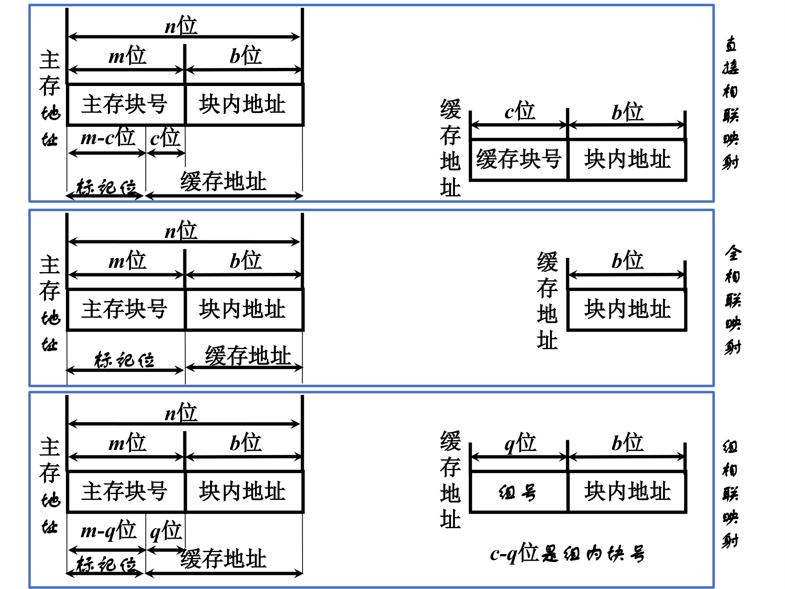
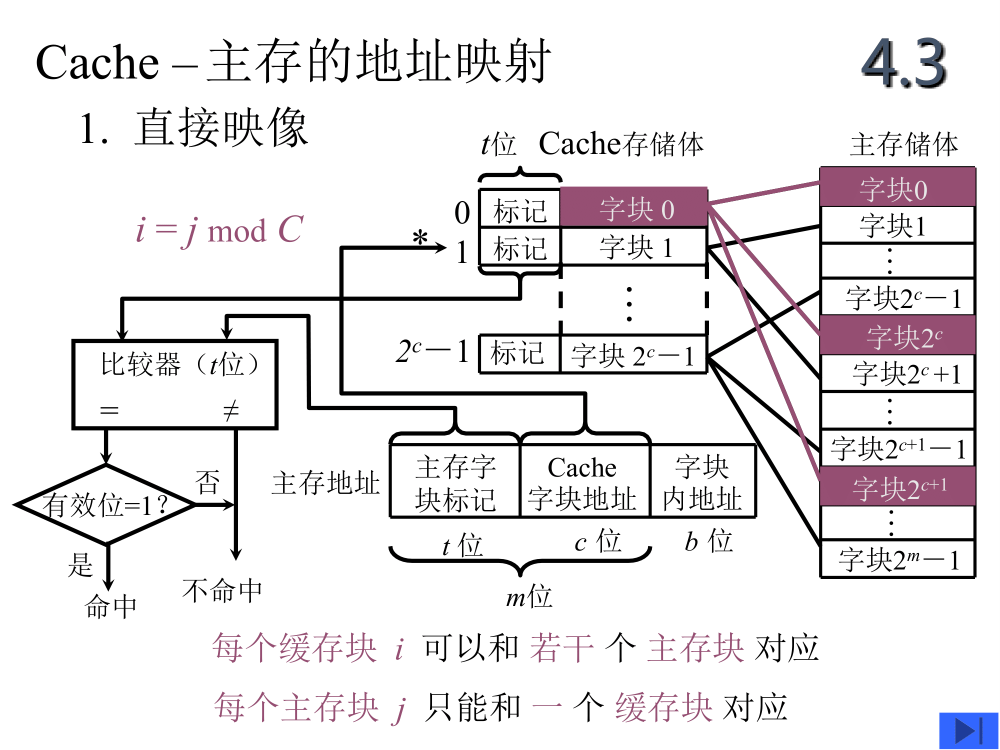
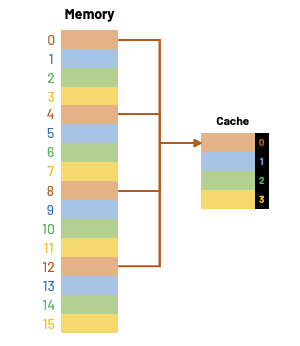
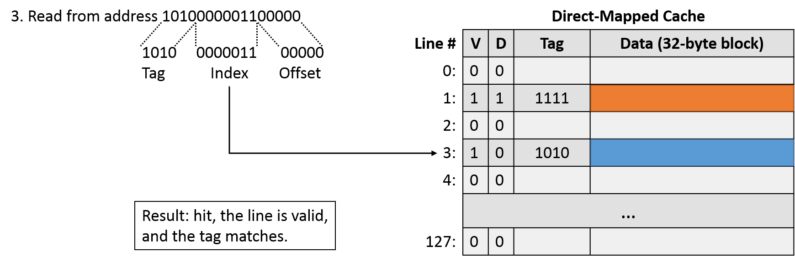
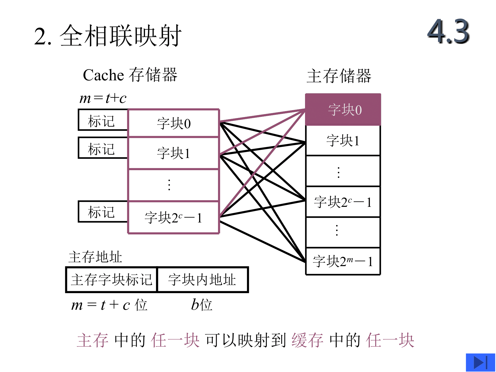
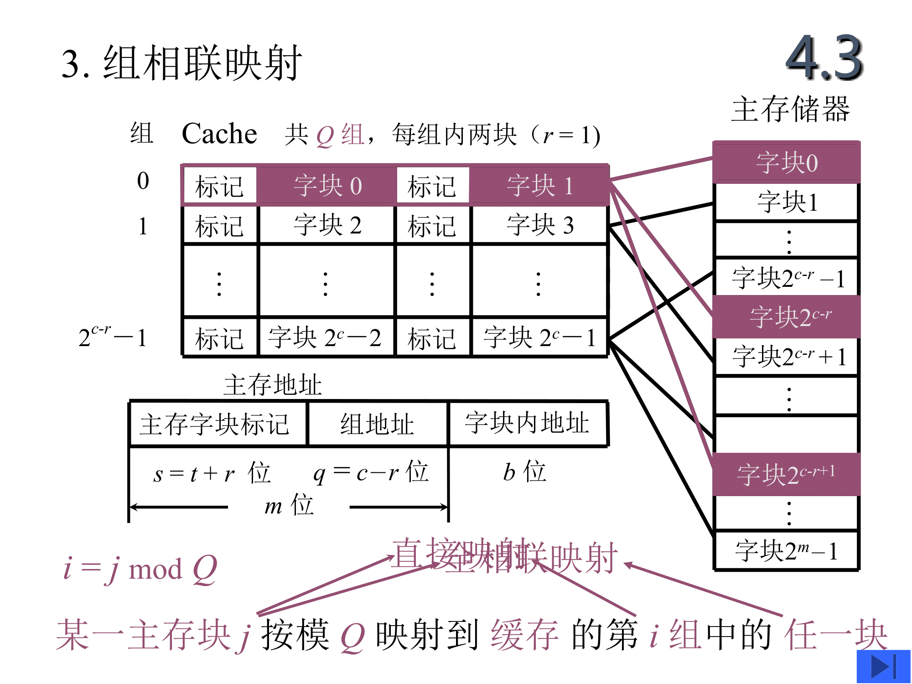

# Cache to Mem

## address



## mapping

- Mapping
	1. Direct, 直接 (Direct-Mapped Cache)
	2. Fully Associative, 全相联
	3. Set Associative, 组相联
- cache lines = 缓存行 = 字块
- 编址方式
	- 按字节
	- 按字



## direct

```c
[   Tag   |   Index   |  Block Offset  ] // memory address, 主存地址
```





这是一种**多对一**的映射关系，多个主存块映射到Cache的某个块上。



## fully associative

```c
[   Tag   |  Block Offset  ] // memory address, 主存地址
```



任意映射，灵活，成本高。

## n-set associative

```c
[   Tag   |   Set Index   |   Block Offset   ] // memory address, 主存地址
```



- 是前2种方式的折衷。组内全相联，组间直接相联。
- 其性能、复杂性均介于直接相联、全相联直接之间。
- 直接相联、全相联是组相联的特例。
