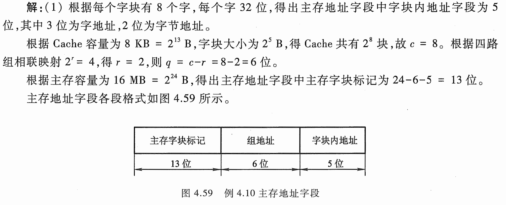

# e4.11-tang3-p121

## key

## sol

mem = 16MB = $2^{24}$B

cache = 8KB = $2^{13}$B

block = 8w = 32B = $2^5$B

1w = 32b = 4B = $2^2$B

4-set = $2^2$set

### 1. 4-set associative

$$
\text{Cache sets}=\frac{\text{Cache blocks}}{\text{n-set}}=\frac{\frac{\text{cache}}{\text{block}}}{\text{n-set}}=\frac{\text{cache}}{\text{block}\times\text{n-set}}=\frac{2^{13}}{2^{5}\times2^2}=2^{6}
$$

| tag                    | set index          | offset                    |
| ---------------------- | ------------------ | ------------------------- |
| 主存字块标记                 | 组地址                | 字块内地址                     |
| mem = 16MB = $2^{24}$B | cache sets = $2^6$ | block = 8w = 32B = $2^5$B |
| 13 = 24-6-5            | 6                  | 5                         |

### 2.

$$
h=\frac{N_c}{N_c+N_m}\times100\%=\frac{100\times10-13}{100\times10}\times100\%=98.7\%
$$

### 3.

$$
=\frac{t_m}{t_a}-1=\frac{t_m}{ht_c+(1-h)t_m}-1=\frac{5t_c}{0.987\times t_c+(1-0.987)\times5t_c}-1\approx3.75
$$

### 4.

0.95057034

$$
e=\frac{t_c}{t_a}=\frac{t_c}{0.987\times{t_c}+(1-0.987)\times5t_c}\times100\%\approx95\%
$$