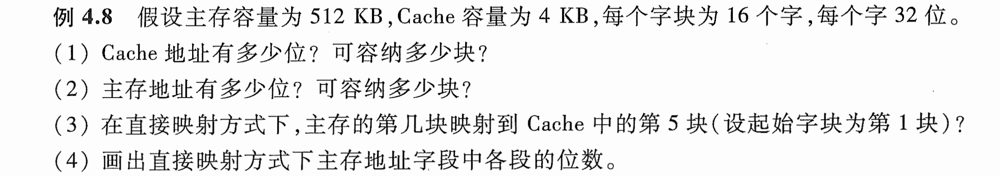
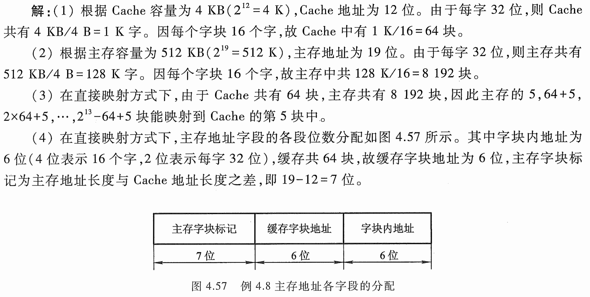

# e4.8-tang3-p120

## key

1. 根据Cache容量为4KB（$2^{12}=4$K），故Cache地址为12位。由于每字32位，则Cache一共有4KB/4B=1K字。因每个字块16个字，故Cache中有1K/16=64块。
2. 根据主存容量为512KB（$2^{19}=512$K），主存地址为19位。由于每字32位，则主存共有512KB/4B=128K字。因每个字块16个字，故主存中共128K/16=8192块。
3. 在直接映射方式下，由于Cache共有64块，主存共有8192块，因此主存的5，64+5，$2\times64+4,\cdots,2^{13}-64+5$块能映射到Cache的第5块中。
4. 在直接映射方式下，主存地址字段的各段位数分配如图所示，其中字块内地址为6位（4位表示16个字，2位表示每字32位），缓存共64块，故缓存字块地址为6位，主存字块标记为主存地址长度与Cache地址长度之差，即19-12=7位。

## sol

mem = 512KB = $2^{19}B$

cache = 4KB = $2^{12}$B -> Cache地址位数 = 12

cache line = block

1w = 32b = 4B

block = 16w = 16 * 4B = 64B = $2^6$B

### 1

**12位，64块。**

$$
2^{\text{Cache地址位数}}=\text{Cache容量}=2^{12}\text{B}
$$

block = 16w = 16 * 4B = 64B = $2^6$B

$$
\text{Cache blocks}=\frac{\text{Cache size}}{\text{block size}}=\frac{2^{12}}{2^{6}}=2^{6}=64
$$

### 2

**19位，8192块。**

$$
2^{\text{Mem地址位数}}=\text{Mem容量}=2^{19}\text{B}
$$

block = 16w = 16 * 4B = 64B = $2^6$B

$$
\text{Mem块数}=\frac{\text{Mem容量}}{\text{块容量}}=\frac{2^{19}}{2^{6}}=2^{13}=8192
$$

### 3

$5, 64+5,2\times 64+5,\cdots, 2^{13}-64+5$

### 4

- 主存地址
	1. 主存字块标记
	2. Cache地址
		1. Cache字块地址
		2. 字块内地址

| tag (mem)       | index (cache)          | offset (cache)        |
| --------------- | ---------------------- | --------------------- |
| mem = $2^{19}B$ | cache blocks = $2^{6}$ | block size = $2^{6}$B |
| 主存字块标记          | Cache字块地址              | 字块内地址                 |
| 7 = 19 - 6 - 6  | 6                      | 6                     |

 