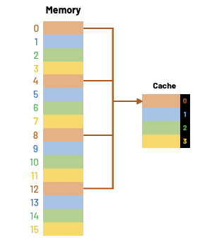

# e4.8-tang3-p120

## key

## sol

mem = 512KB = $2^{19}B$

cache = 4KB = $2^{12}$B -> Cache地址位数 = 12

cache line = block

1w = 32b = 4B

block = 16w = 16 * 4B = 64B = $2^6$B

### 1

**12位，64块。**

$$
2^{\text{Cache地址位数}}=\text{Cache容量}=2^{12}\text{B}
$$

block = 16w = 16 * 4B = 64B = $2^6$B

$$
\text{Cache blocks}=\frac{\text{Cache size}}{\text{block size}}=\frac{2^{12}}{2^{6}}=2^{6}=64
$$

### 2

**19位，8192块。**

$$
2^{\text{Mem地址位数}}=\text{Mem容量}=2^{19}\text{B}
$$

block = 16w = 16 * 4B = 64B = $2^6$B

$$
\text{Mem块数}=\frac{\text{Mem容量}}{\text{块容量}}=\frac{2^{19}}{2^{6}}=2^{13}=8192
$$

### 3

$5, 64+5,2\times 64+5,\cdots, 2^{13}-64+5$

## 4

- 主存地址
	1. 主存字块标记
	2. Cache地址
		1. Cache字块地址
		2. 字块内地址

| tag (mem)       | index (cache)          | offset (cache)        |
| --------------- | ---------------------- | --------------------- |
| mem = $2^{19}B$ | cache blocks = $2^{6}$ | block size = $2^{6}$B |
| 主存字块标记          | Cache字块地址              | 字块内地址                 |
| 7 = 19 - 6 - 6  | 6                      | 6                     |

 