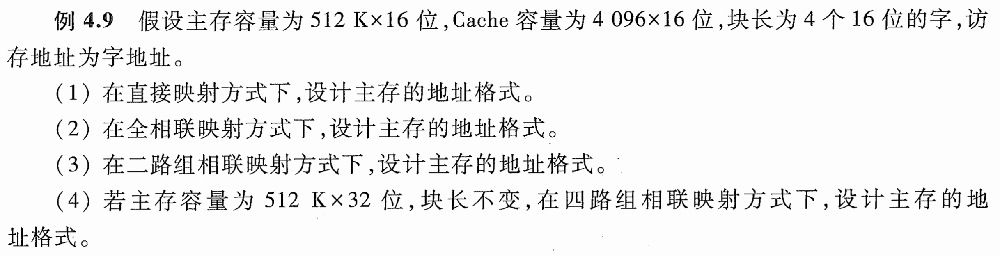
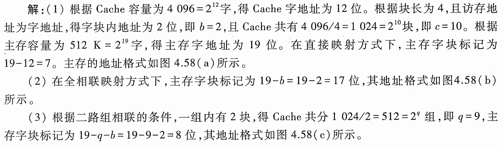
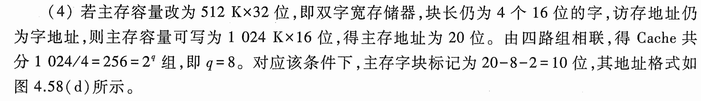
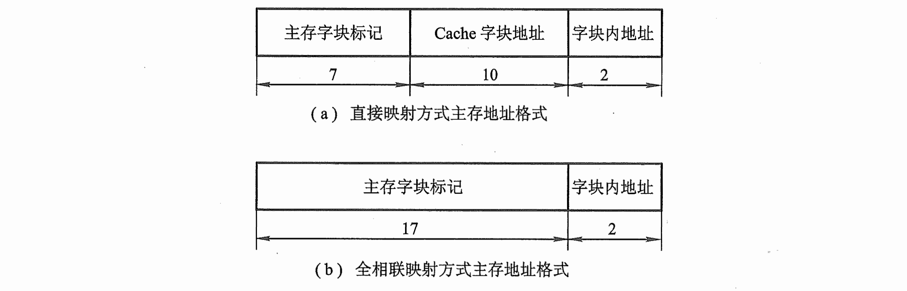
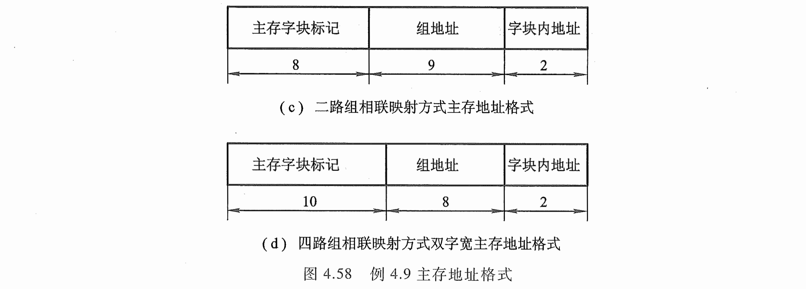

# e4.9-tang3-p120

## key

1. 根据Cache容量为$4096=2^{12}$字，得Cache字地址为12位。根据块长位4，且访存地址为字地址，得字块内地址为2位，即b=2，切Cache共有$4096/4=1024=2^{10}$块，即c=10.根据主存容量为$512K=2^{19}$字，得主存字地址为19位。在直接映射方式下，主存字块标记为19-12=7。主存的地址格式如图所示。
2. 在全相联映射方式下，主存字块标记为19-b=19-2=17位，其地址格式如图所示。
3. 根据二路组相联的条件，一组内有2块，得Cache共分1024/2=512=$2^q$组，即q=9，主存字块标记为19-q-b=19-9-2=8位，其地址格式如图所示。
4. 若主存容量改为$512K\times32$位，即双字宽存储器，块长仍为4个16位的字，访存地址仍为字地址，则主存容量可写为$1024K\times16$位，得主存地址位20位。由四路组相联，得Cache共分$1024/4=256=2^q$组，即q=8。对应该条件下，主存字块标记为20-8-2=10位，其地址格式如图所示。

## sol

w: 访存地址为字地址

mem = 512k * 16b = 512kw = $2^{19}$w

cache = 4096 * 16b = 4096w = $2^{12}$w

block = 4w = $2^2$w

1w = 16b

### 1. direct

cache blocks = cache size / block size = $\frac{2^{12}}{2^2}=2^{10}$

| tag                 | index                   | offset         |
| ------------------- | ----------------------- | -------------- |
| mem = $2^{19}$w     | cache blocks = $2^{10}$ | block = $2^2$w |
| 主存字块标记              | Cache字块地址               | 字块内地址          |
| **7 = 19 - 10 - 2** | **10**                  | **2**          |

### 2. fully associative

| tag             | offset         |
| --------------- | -------------- |
| 主存字块标记          | 字块内地址          |
| mem = $2^{19}$w | block = $2^2$w |
| 17 = 19 - 2     | 2              |

### 3. 2 set associative

$$
\text{cache sets} = \frac{\text{cache blocks}}{2}\text{(二路组相联)}= 2^{9}\text{sets}
$$

| tag                | set index          | offset         |
| ------------------ | ------------------ | -------------- |
| 主存字块标记             | 组地址                | 字块内地址          |
| mem = $2^{19}$w    | cache sets = $2^9$ | block = $2^2$w |
| **8 = 19 - 9 - 2** | **9**              | **2**          |

### 4. 4 set associative

mem = 512k * 32 = 512k * 2w = $2^{20}$ w

$$
\text{cache sets} 
= \frac{\text{cache blocks}}{4}\text{(二路组相联)}
= \frac{2^{10}}{2^2}
= 2^{8}\text{sets}
$$

| tag                 | set index          | offset         |
| ------------------- | ------------------ | -------------- |
| 主存字块标记              | 组地址                | 字块内地址          |
| mem = $2^{20}$w     | cache sets = $2^8$ | block = $2^2$w |
| **10 = 20 - 8 - 2** | **8**              | **2**          |
