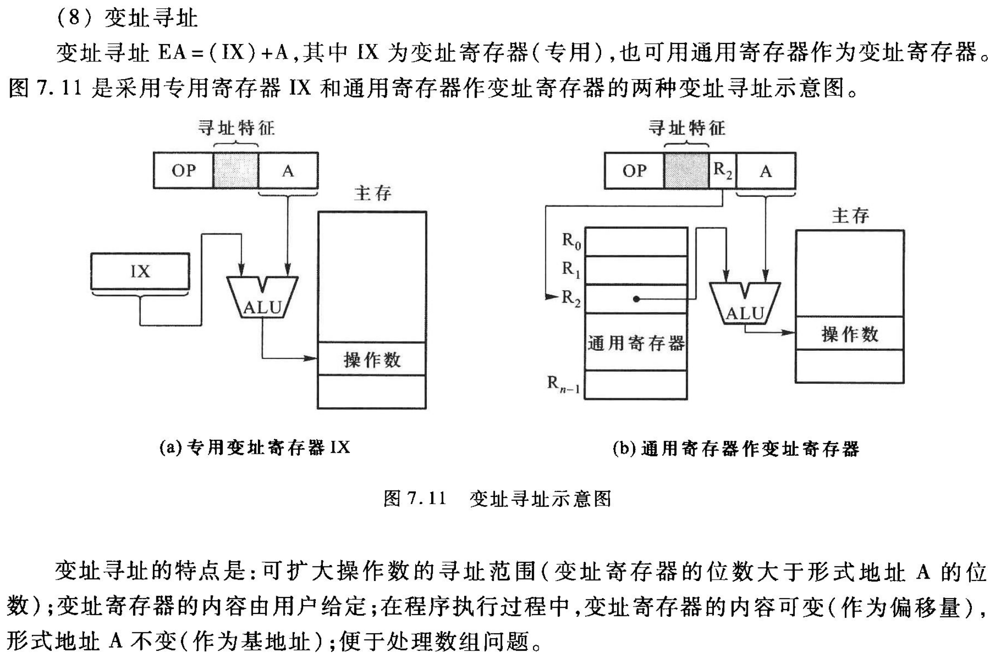

---
aliases:
  - 寻址方式
  - Addressing Modes
---

# Addressing Modes | 寻址方式

\[[寻址方式-tang2-psets.pdf](assets/寻址方式-tang2-psets.pdf)\]

## 指令寻址 (2)

下一条欲执行指令的指令地址。

### 1. 顺序寻址

- (PC) + 1 -> PC

### 2. 跳跃寻址

- 转移类指令

## 数据寻址 (10) - 操作数

确定本条指令的操作数地址。


- OP 操作码
- M 寻址特征 / 寻址方式
- A 形式地址

![[../assets/470L22W24/470L22W24-27.png]]
![[../assets/李曦2025-指令系统/李曦2025-指令系统-19.png]]

### 1. \# immediate, 立即寻址 (literal)

```c
operand = #A; // 立即数（补码）
```


### 2. direct, 直接寻址 (absolute)

```c
operand = M(EA) = M(A); // EA = A
```


### 3. implicit, 隐含寻址

```c
operand = OP(ACC, 堆栈);
```


### 4. @ indirect, 间接寻址

```c
operand = M[EA] = M[M[A]];
```

- 1次间接寻址
- n次间接寻址


### 5. register, 寄存器寻址


#### 5.1 register direct, 寄存器(直接)寻址

```c
operand = (EA) = (Ri) // EA = Ri(寄存器编号)
```


#### 5.2 register indirect, 寄存器间接寻址

```c
operand = M(EA) = M((Ri)) // EA = (Ri)
```


#### 5.3. displacement, 基址寻址

```c
operand = M[EA] = M[ (BR) + #A ] // BR, (专用)基址寄存器, Base Register
operand = M[EA] = M[ (Ri) + #A ] // Ri, (通用)寄存器 as 基址寄存器
```


#### 5.4 indexed 变址寻址

```c
operand = M[EA] = M[ (IX++/--) + #A ] // IX, (专用)变址寄存器
operand = M[EA] = M[ (Ri++/--) + #A ] // Ri, (通用)寄存器 as 变址寄存器
```




#### 5.5 * 相对寻址 (高频)

```c
operand = M[EA] = M[ (PC) + #A ]
```


---

- offset + PC，不要管编码，结果不会错
- offset 是补码，表示范围是 $[-2^{n-1}, 2^{n-1}-1]$
- 计算目标地址
	- `PC + "1" + offset` 这里的 offset 是偏移的地址数
	- `PC + "1" + offset*4` 这里的 offset 是偏移的指令条数
	- PC 到底加多少，取决于1条指令占多少个地址（观察指令长度和编址单位）

### 6. 堆栈寻址


SP, Stack Pointer

