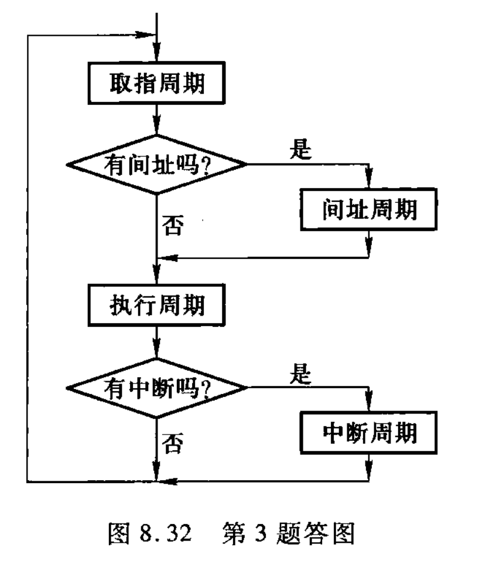

# 指令周期

> 画出指令周期的流程图，分别说明图中每个子周期的作用。
> 
> —— 8.3-tang3-p370
> 
> —— 8.4.3.3-tang2psets-p268p273

---

- **IF** -> (OF) -> **EXE** -> (INT)

---

- **取指周期 IF**
	- IF: 取指令
	- ID: 分析指令 / 译码
- **间址周期 OF**：用于取操作数 (operand) 的有效地址 (EA)；
- **执行周期 EXE**：完成执行指令的操作；
- **中断周期 INT (Save → Disable → Load)**：当CPU**响应中断**时，由**中断隐指令 (implicit interrupt instruction)** 完成
	- save PC: 保护程序断点
	- disable INT: 硬件关中断
	- load PC: 向量地址 (vector) 送 PC（硬件向量法）的操作。

| 内容              | 概括              | 解释                            |
| --------------- | --------------- | ----------------------------- |
| 保护程序断点          | **Save PC**     | 保存断点，保留程序现场（即 PC）             |
| 硬件关中断           | **Disable Int** | 硬件自动关中断                       |
| 向量地址送 PC（硬件向量法） | **Load Vector** | 把中断服务程序 (ISR, vector) 地址送入 PC |

## others

[http://staff.ustc.edu.cn/~llxx/cod/courseware/2025/2025-1.pdf](http://staff.ustc.edu.cn/~llxx/cod/courseware/2025/2025-1.pdf)

---

[http://www.math.uaa.alaska.edu/~afkjm/cs221/handouts/ch11-113.pdf](http://www.math.uaa.alaska.edu/~afkjm/cs221/handouts/ch11-113.pdf)

