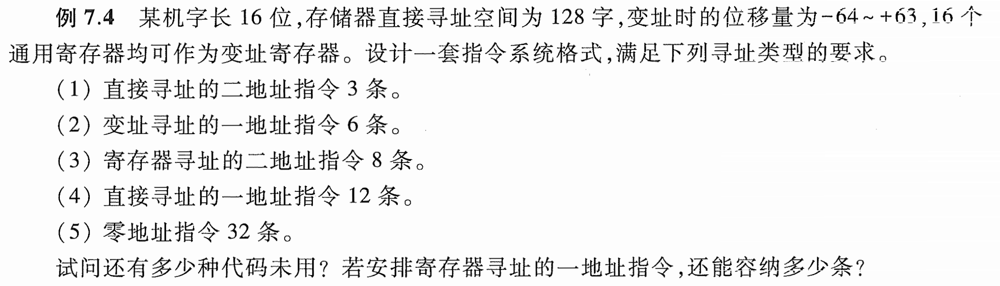
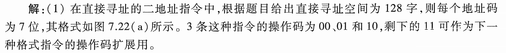
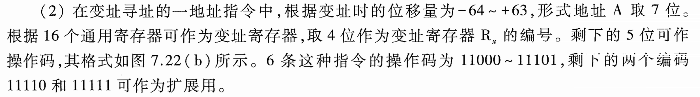
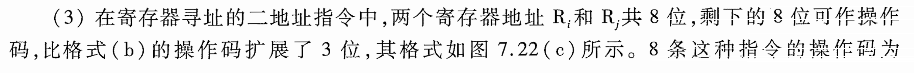
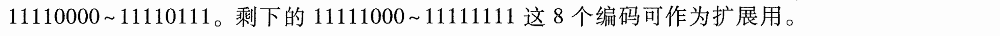
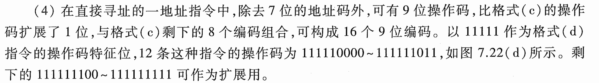
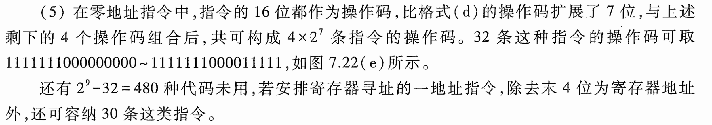

# e7.4-tang3-p322

- 1w = 16b
- 直接寻址空间 direct = 128w = $2^7$w
- IX = 16 = $2^4$
- offset(indexed) = 128 = $2^7$

## key

### 1

- 直接寻址 / 直接寻址空间
- 二地址指令
- 地址码
- 指令格式
- 操作码
- 操作码扩展窗口

---

在直接寻址的二地址指令中，根据题目给出直接寻址空间位128字，则每个地址码为7位，其格式如图所示。3条这种指令的操作码为00、01和10，剩下的11可作为下一种格式指令的**操作码扩展**用。

### 2

- $R_x$ 变址寄存器编号 - 选择
- A 偏移量

---

在变址寻址的一地址指令中，根据变址时的位移量为-64～+63，形式地址A取7位。根据16个通用寄存器可作为变址寄存器，取4位作为变址寄存器$R_x$的编号。剩下的5位可作操作码，其格式如图所示。6条这种指令的操作码为11000～11101，剩下的两个编码11110和11111可作为扩展用。

### 3

在寄存器寻址的二地址指令中，两个寄存器地址$R_i$和$R_j$共8位，剩下的8位可作操作码，比上一格式的操作码扩展了3位，其格式如图所示。8条这种指令的操作码为11110000～11110111。剩下的11111000～11111111这8个编码可作为扩展用。

### 4

在直接寻址的一地址指令中，除去7位的地址码外，可有9位操作码，比上一格式扩展了1位，与上一格式剩下的8个编码组合，可构成16个9位编码。以11111作为该格式指令的操作码特征位，12条这种指令的操作码为111110000～111111011，如图所示。剩下的111111100～111111111可作为扩展用。

### 5

在零地址指令中，指令的16位都作为操作码，比上一格式（9b）的操作码扩展了7位，与上述剩下的4个操作码组合后，共可构成$4\times2^7$条指令的操作码。32条这种指令的操作码可取1111111000000000～1111111000011111，如图所示。

还有$2^9-32=480$种代码未用，若安排寄存器寻址的一地址指令，除去末4位为寄存器地址，还可以容纳30条这类指令。

| 12  | 4   |
| --- | --- |
| OP  | Ri  |

为什么是30种？考虑上面的地址：

| 1111111 | 00000 | 0000 |
| ------- | ----- | ---- |
| 1111111 | 00001 | 1111 |
对于中间的5位来说，00000、00001已经用了，$2^{5}-2=30$，也就是30种。
