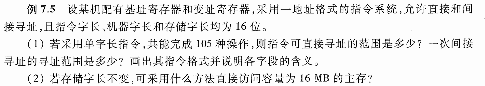
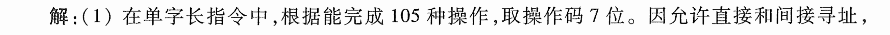
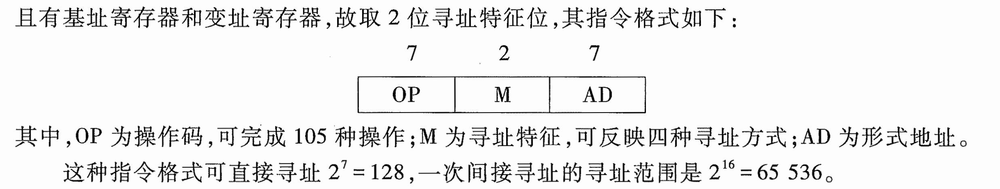
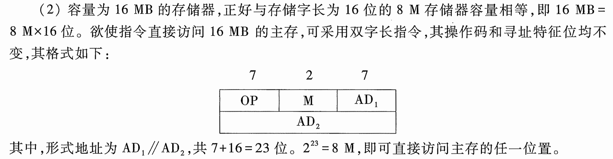

# e7.5-tang3-p323

- BR, IX
- direct, indirect
- 1 addr.
- 指令字长 = 机器字长 = 存储字长 = 16b
- mem = 16MB = $2^{24}$B

## key

### 1

在单字长指令中，根据能完成105种操作，取操作码7位。因允许直接和间接寻址，且有基址寄存器和变址寄存器，故取2位寻址特征位，其指令格式如下：

其中，OP为操作码，可完成105种操作；M为寻址特征，可反映四种寻址方式；AD为形式地址。

这种指令格式可直接寻址$2^7=128$，一次间接寻址的寻址范围是$2^{16}=65536$。

- 单字长指令：指令字长 = 机器字长
- OP 操作码
	- 码长 <- 操作数
- M 寻址特征码
	- 码长 <- 寻址方式数
		- base
		- indexed
		- direct
		- indirect
- AD 地址码 / 形式地址（直接寻址）
	- 码长 -> 直接寻址空间
- 指令格式
- 一次间址空间 <- 存储字长

### 2

容量为16MB（$2^{24}$）的存储器，正好与存储字长为16位的8M存储器容量相等，即16MB=$8M\times16\text{位}$。欲使指令直接访问16MB的主存，可采用双字长指令，其操作码和寻址特征位均不变，其格式如下：

其中，形式地址位$AD_1//AD_2$，共7+16=23位。$2^{23}=8M$，即可直接访问主存的任一位置。

- 存储器容量 = 16MB + 存储字长 = 16b
	- 等于两片 8M * 16b 的存储芯片
- 双字长指令
	- 指令字长 = 2 * 机器字长
