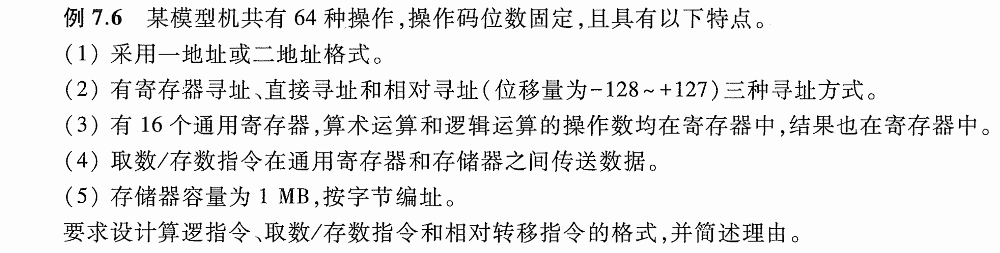
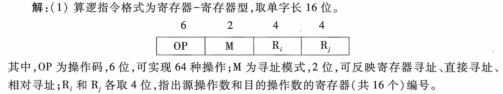
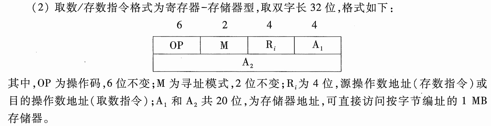
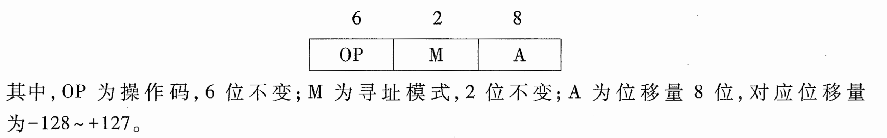

# e7.6-tang3-p324

- 操作数 -> 操作码码长

## key

### 1

- 算逻指令格式：Ri-Rj

---

算逻指令格式为寄存器-寄存器型，取单字长16位。

其中，OP为操作码，6位，可实现64种操作；M为寻址模式，2位，可反映寄存器寻址、直接寻址、相对寻址；$R_i$和$R_j$各取4位，指出源操作数和目的操作数的寄存器（共16个）编号。

### 2

- 取数/存数指令格式：Ri-M

---

取数/存数指令格式为寄存器-存储器型，取双字长32位，格式如下：

其中，OP为操作码，6位不变；M为寻址模式，2位不变；$R_i$为4位，源操作数地址（存数指令）或目的操作数地址（取数指令）；$A_1$和$A_2$共20位，为存储器地址，可直接访问按字节编址的1MB存储器。

### 3

相对转移指令为一地址格式，取单字长16位，格式如下：

其中，OP位操作码，6位不变，M为寻址模式，2位不变；A为位移量8位，对应位移量为-128～+127。
