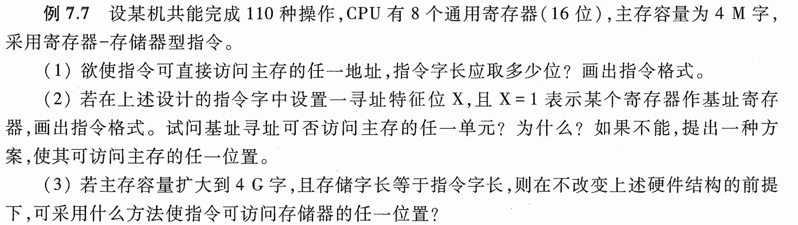
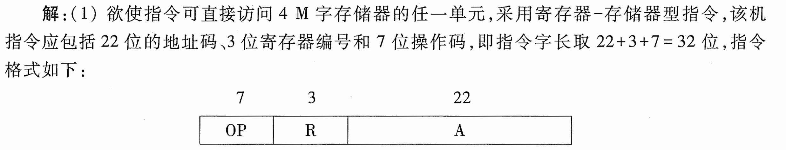
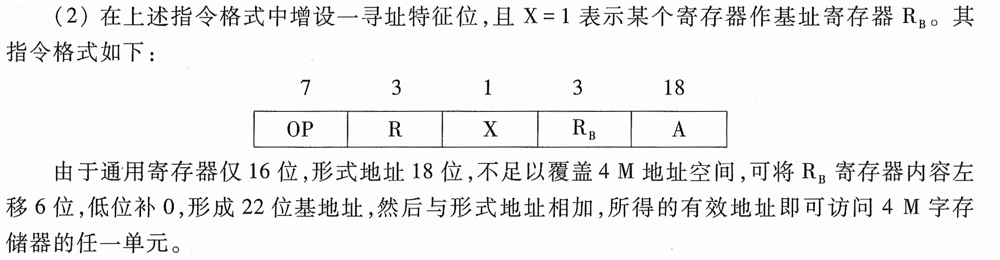
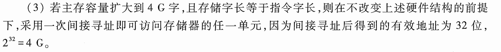

# e7.7-tang3-p325

## key

### 1

欲使指令可直接访问4M字存储器的任一单元，采用寄存器-存储器型指令，该机指令应包括22位的地址码、3位寄存器编码和7位操作码，即指令字长去22+3+7=32位，指令格式如下：

- 寄存器-存储器型指令
- 地址码 / 寄存器编号 / 操作码
- 指令字长

### 2

在上述指令格式中增设一寻址特征位，且 X = 1 表示某个寄存器作基址寄存器 $R_B$ （BR）。其指令格式如下：

由于通用寄存器仅16位，A形式地址18位，不足以覆盖4M（$2^{22}$）地址空间，可将 $R_B$ 寄存器内容左移6位（16+6=22位），低位补0，形成22位**基地址**，然后与形式地址相加，所得的有效地址即可访问4M字存储器的任一单元。

### 3

若主存容量扩大到4G字（mem = 4G = $2^{32}$），其**存储字长**等于**指令字长**，则在不改变上述硬件结构的前提下，采用**一次间接寻址**即可访问存储器的任一单元，因为间接寻址后得到的有效地址（EA）为32位，$2^{32}=4\text{G}$。

---

总结：存储器一次间接寻址空间，取决于存储字长。或者说，一次间接寻址后得到的EA有效地址，等于存储字长。

