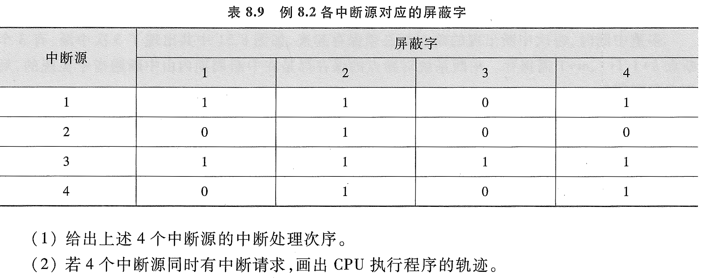
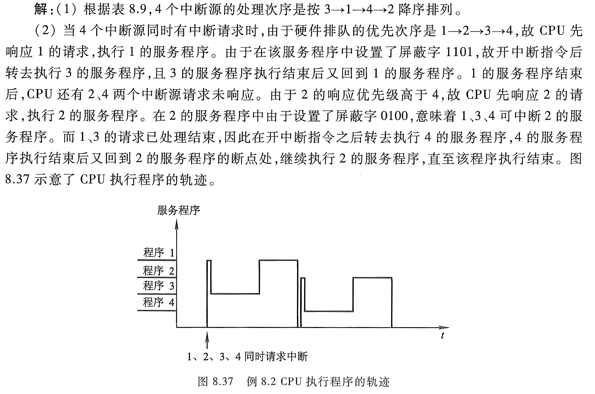

# e8.2-tang3-p368

设某机有4个**中断源**1、2、3、4，其**硬件排队优先次序**按1、2、3、4降序排列，各中断源的服务程序中所对应的屏蔽字如表所示。

1. 给出上述4个中断源的中断处理次序。
2. 若4个中断源同时有中断请求，画出CPU执行程序的轨迹。

## key

### 1

根据表，4个中断源的处理次序是按3、1、4、2降序排列。

### 2

当4个中断源同时有中断请求时，由于硬件排队的优先次序是1、2、3、4，故CPU先响应1的请求，执行1的服务策划个女婿。由于在该服务程序中设置了屏蔽字1101，故**开中断指令**后转去执行3的服务程序，且3的服务程序执行结束后又回到1的服务程序。1的服务程序结束后，CPU还有2、4两个中断源请求未响应。由于2的响应优先级高于4，故CPU先响应2的请求，执行2的服务程序。在2的服务程序中由于设置了屏蔽字0100，意味着1、3、4可中断2的服务程序。而1、3的请求已处理结束，因此在开中断指令之后转去执行4的服务程序，4的服务程序执行结束后又回到2的服务程序的断点处，继续执行2的服务程序，直至该程序执行结束。如图示意了CPU执行程序的轨迹。

---

CPU 执行程序轨迹中断源，中断源的服务程序（中断服务程序），屏蔽字
排队器-硬件排队优先次序
中断源的中断处理次序

| Interrupt Source\Mask Bit | 1   | 2   | 3   | 4   | 1的个数（屏蔽的个数） |
| ------------------------- | --- | --- | --- | --- | ----------- |
| 1                         | 1   | 1   |     | 1   | 3           |
| 2                         |     | 1   |     |     | 2           |
| 3                         | 1   | 1   | 1   | 1   | 4           |
| 4                         |     | 1   |     | 1   | 1           |

1的个数越多，说明这个中断源屏蔽了更多的其他中断源，其处理优先级也就更高。
排队优先级 不等于 处理优先级
处理优先级根据屏蔽字，或者说，屏蔽情况所决定。

中断源的处理次序 = 处理优先级
硬件排队优先次序 = 排队优先级

CPU执行程序的轨迹

---

下面是对你这份笔记的**系统润色与逻辑梳理**，包括：

1. **语言修正和逻辑清晰化**
    
2. **结合408考研内容的补充说明**
    
3. **笔记主题与建议文件名**
    

---

# 中断源优先级、屏蔽字与中断处理次序

## 一、CPU 执行程序的轨迹与中断源

在程序运行过程中，CPU 可能接收到多个中断请求。中断请求的处理顺序涉及多个概念：**中断源、屏蔽字、排队优先级、处理中断的优先级等**。

---

## 二、关键概念梳理

|概念|含义|
|---|---|
|**中断源**|发出中断请求的设备或模块|
|**屏蔽字（Mask Bit）**|每个中断源对应一个屏蔽字，控制该中断源能否屏蔽其他中断|
|**排队优先级（Queue Priority）**|硬件电路中固定的优先级，例如中断源 1 > 中断源 2 > ...|
|**处理中断的优先级（Handling Priority）**|根据屏蔽字配置确定的优先级，决定谁先被处理|
|**中断服务程序**|响应中断请求的处理代码段|

---

## 三、屏蔽字与处理中断优先级

下表表示每个中断源能屏蔽的其他中断源（以 `1` 表示可屏蔽）：

|中断源编号|可屏蔽 1|可屏蔽 2|可屏蔽 3|可屏蔽 4|屏蔽总数|
|---|---|---|---|---|---|
|1|✅|✅||✅|3|
|2||✅|||1|
|3|✅|✅|✅|✅|4|
|4||✅||✅|2|

> **结论**：一个中断源能屏蔽的中断源越多，其**处理优先级越高**。

---

## 四、处理优先级 ≠ 排队优先级

- **排队优先级（硬件级）**：CPU 接收到多个中断时，先响应哪个，是由硬件电路排队器决定的，固定优先顺序。例如：中断源1 > 源2 > 源3 > 源4。
    
- **处理中断优先级（软件级）**：根据每个中断源屏蔽其他中断的能力（屏蔽字）动态决定。中断服务程序按此优先级执行。
    

✅ **最终处理中断的顺序 = 处理中断优先级决定的顺序，而非排队顺序。**

---

## 408考研补充重点：

- 在 408《计算机组成原理》中，考查常围绕以下方面展开：
    
    1. **中断屏蔽与优先级控制**：是否可以通过屏蔽字设置处理优先级？
        
    2. **中断排队器 VS 中断控制器**：两者分别管理哪一层的优先级？
        
    3. **中断处理流程**：保存现场、执行中断服务程序、恢复现场、返回。
        
- 常见题型：判断/选择题，考你区分“排队优先级”和“处理优先级”。
    