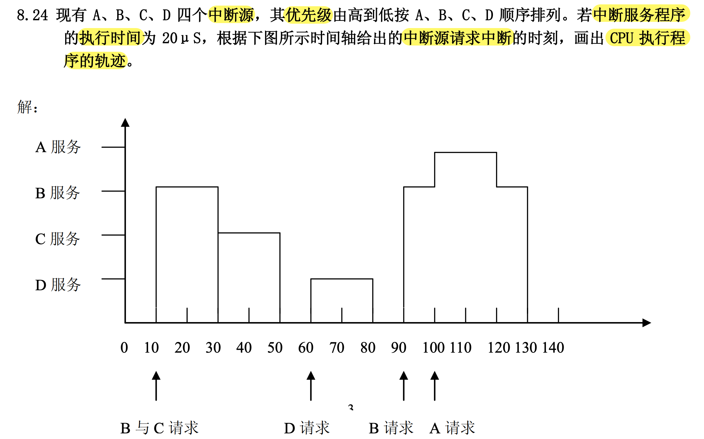
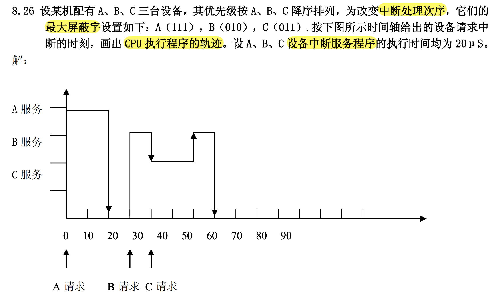
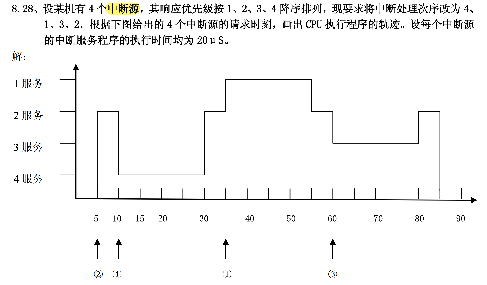
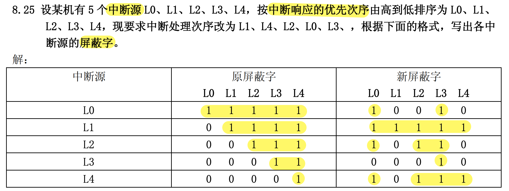

# psets

## CPU执行程序的轨迹

---

---

---

[南京理工大学2021年硕士学位研究生入学考试试题](https://gs.njust.edu.cn/_upload/article/files/5f/c5/7548303f436597689a6e7ed77163/fda9ce17-e022-40d5-8912-f2212332a3a5.pdf)

## 屏蔽字

