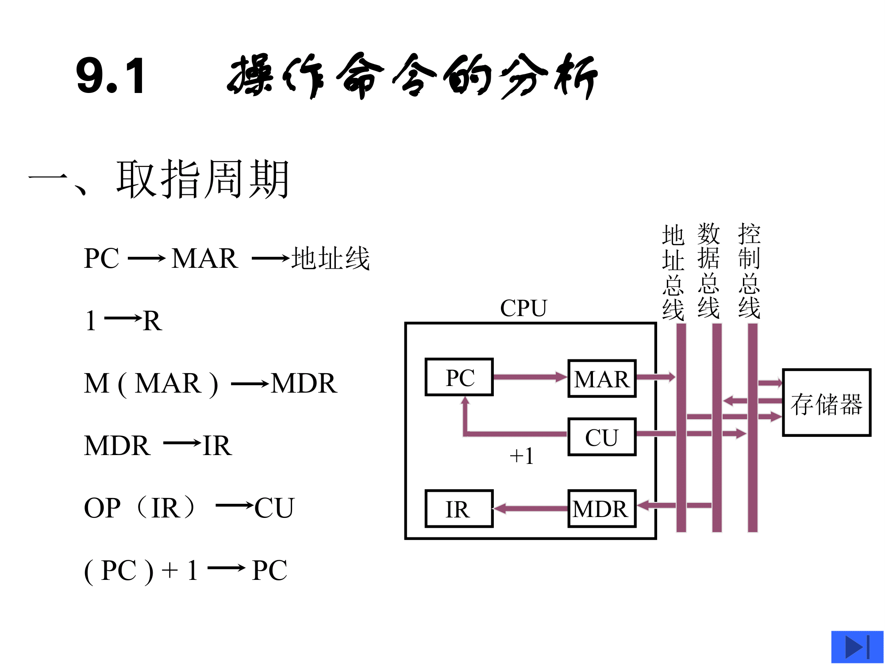
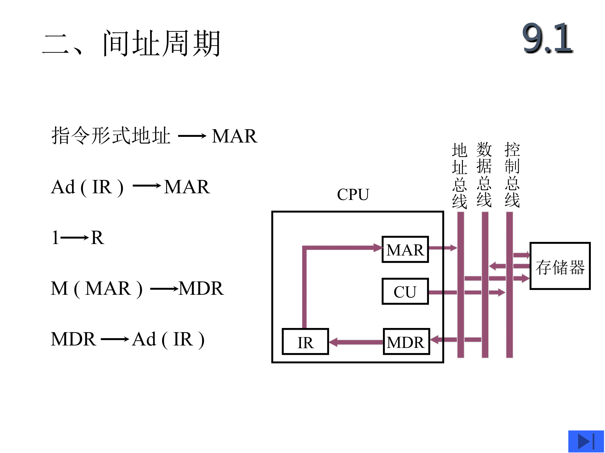
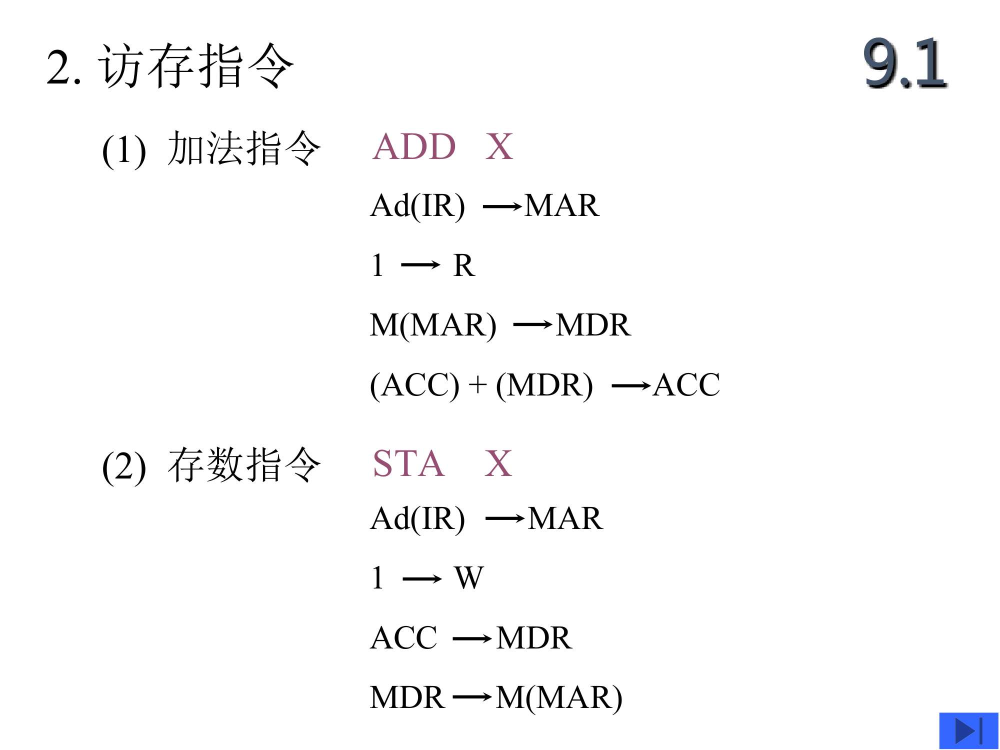
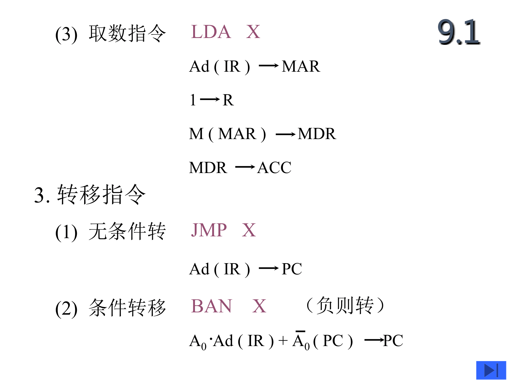

# CU | 控制单元

## 取指周期

| 节拍安排 | 微操作命令                                            | 说明                |
| ---- | ------------------------------------------------ | ----------------- |
| T0   | PC -> Bus -> MAR (-> AB), 1 -> R                 | PC通过总线送MAR，命令存储器读 |
| T1   | Mem: M(MAR) -> MDR CPU: (PC) + 1 -> PC        |                   |
| T2   | **MDR -> Bus -> IR, OP(IR) -> CU(微操作命令形成部件)** | MDR通过总线送IR，操作码送CU |

## 间址周期

| 节拍安排 | 微操作命令                     | 说明                  |
| ---- | ------------------------- | ------------------- |
| T0   | Ad(IR) → Bus → MAR, 1 → R | 形式地址送 MAR，启动存储器读操作  |
| T1   | M(MAR) → MDR              | 从内存中取出有效地址 EA 到 MDR |
| T2   | MDR → Ad(IR)              |                     |

## 访存指令

| 节拍安排 | 微操作命令                       | 说明  |
| ---- | --------------------------- | --- |
| T0   | Ad(IR) -> MAR, 1 -> R       |     |
| T1   | M(MAR) -> MDR               |     |
| T2   | (MDR) + (ACC) -> ALU -> ACC |     |

| 节拍安排 | 微操作命令                 | 说明  |
| ---- | --------------------- | --- |
| T0   | Ad(IR) -> MAR, 1 -> W |     |
| T1   | ACC -> MDR            |     |
| T2   | MDR -> M(MAR)         |     |

| 节拍安排 | 微操作命令                 | 说明  |
| ---- | --------------------- | --- |
| T0   | Ad(IR) -> MAR, 1 -> R |     |
| T1   | M(MAR) -> MDR         |     |
| T2   | MDR -> ACC            |     |

| 节拍安排 | 微操作命令        | 说明  |
| ---- | ------------ | --- |
| T0   |              |     |
| T1   |              |     |
| T2   | Ad(IR) -> PC |     |

| 节拍安排 | 微操作命令                                      | 说明  |
| ---- | ------------------------------------------ | --- |
| T0   |                                            |     |
| T1   |                                            |     |
| T2   | $A_0\cdot Ad(IR)+\overline{A_0}(PC)$ -> PC |     |

## 中断周期

| 节拍安排 | 微操作命令                              | 说明  |
| ---- | ---------------------------------- | --- |
| T0   | (SP)-1 -> SP -> MAR, 1 -> W, 硬件关中断 |     |
| T1   | PC -> MDR                          |     |
| T2   | MDR -> M(MAR), 向量地址 -> PC          |     |

- 向量地址 -> PC -> MDR -> M((SP)-1)
- PC压入栈中，向量地址送PC
