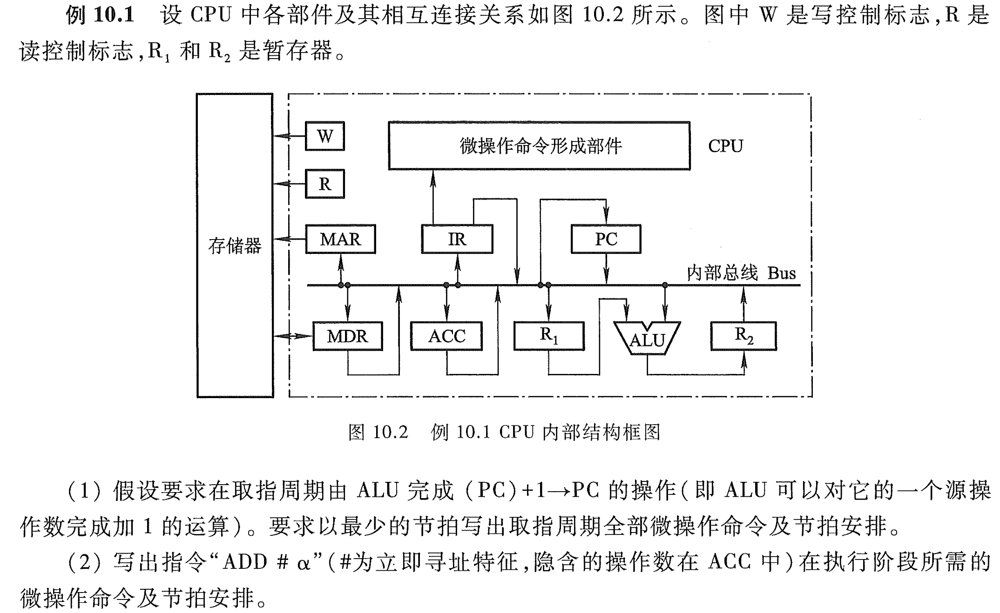
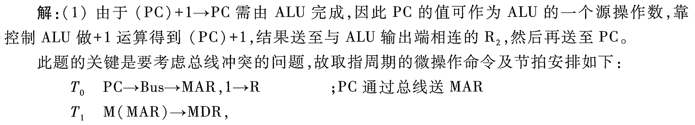
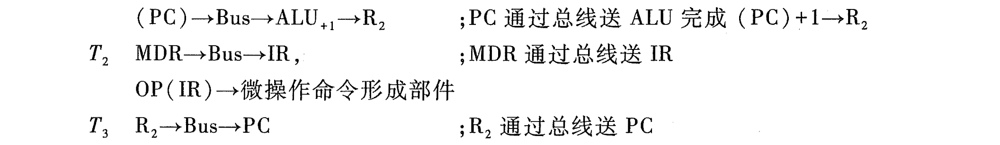
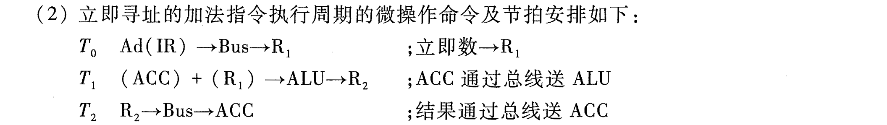

# e10.1-tang3-p398

- W 写控制标志
- R 读控制标志
- R1, R2 暂存器

## key

### 1

| 节拍安排 | 微操作命令                                                 | 说明                         |
| ---- | ----------------------------------------------------- | -------------------------- |
| T0   | PC -> Bus -> MAR, 1 -> R                              | PC通过总线送MAR，命令存储器读          |
| T1   | mem: M(MAR) -> MDR CPU: (PC) -> Bus -> ALU+1 -> R2 | PC通过总线送ALU完成(PC) + 1 -> R2 |
| T2   | **MDR -> Bus -> IR, OP(IR) -> 微操作命令形成部件**          | MDR通过总线送IR                 |
| T3   | R2 -> Bus -> PC                                       | R2通过总线送PC                  |

### 2

**立即寻址的加法指令执行周期**的微操作命令、节拍安排如下：

| 节拍安排 | 微操作命令                     | 说明          |
| ---- | ------------------------- | ----------- |
| T0   | Ad(IR) -> Bus -> R1       | 立即数 -> R1   |
| T1   | (ACC) + (R1) -> ALU -> R2 | ACC通过总线送ALU |
| T2   | R2 -> Bus -> ACC          | 结果通过总线送ACC  |

