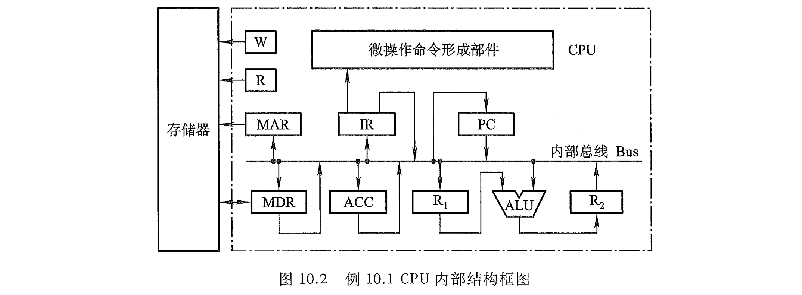

# e10.2-tang3-p399

## key

### IF

| 节拍安排 | 微操作命令                                        | 说明                |
| ---- | -------------------------------------------- | ----------------- |
| T0   | PC -> Bus -> MAR, 1 -> R                     | PC通过总线送MAR，命令存储器读 |
| T1   | mem: M(MAR) -> MDR CPU: （PC) + 1 -> PC    | (PC) + 1          |
| T2   | **MDR -> Bus -> IR, OP(IR) -> 微操作命令形成部件** | MDR通过总线送IR        |

### 1

| 节拍安排 | 微操作命令                   | 说明        |
| ---- | ----------------------- | --------- |
| T0   | C -> Bus -> R1          |           |
| T1   | (B) + (R1) -> ALU -> R2 | B通过总线送ALU |
| T2   | R2 -> Bus -> B          |           |

### 2

| 节拍安排 | 微操作命令                   | 说明               |
| ---- | ----------------------- | ---------------- |
| T0   | H -> Bus -> MAR, 1 -> R | H通过总线送MAR，命令存储器读 |
| T1   | M(MAR) -> MDR           |                  |

| 节拍安排 | 微操作命令                   | 说明        |
| ---- | ----------------------- | --------- |
| T0   | MDR -> Bus -> R1        |           |
| T1   | (E) - (R1) -> ALU -> R2 | E通过总线送ALU |
| T2   | R2 -> Bus -> E          |           |

### 3

| 节拍安排 | 微操作命令                        | 说明                  |
| ---- | ---------------------------- | ------------------- |
| T0   | Ad(IR) -> Bus -> MAR, 1 -> R | 形式地址通过总线送MAR，命令存储器读 |
| T1   | M(MAR) -> MDR                | 从存储器中取有效地址          |

| 节拍安排 | 微操作命令                     | 说明                  |
| ---- | ------------------------- | ------------------- |
| T0   | MDR -> Bus -> MAR, 1 -> W | 有效地址通过总线送MAR，命令存储器写 |
| T1   | ACC -> Bus -> MDR         |                     |
| T2   | MDR -> M(MAR)             |                     |

