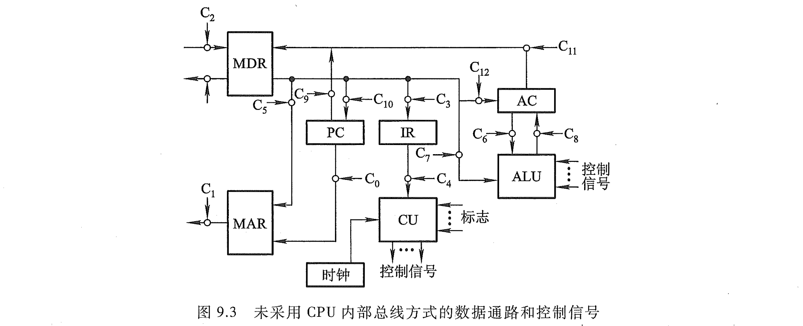
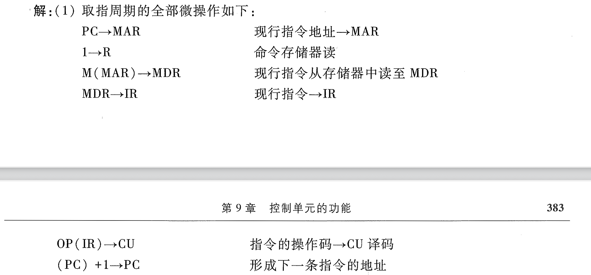
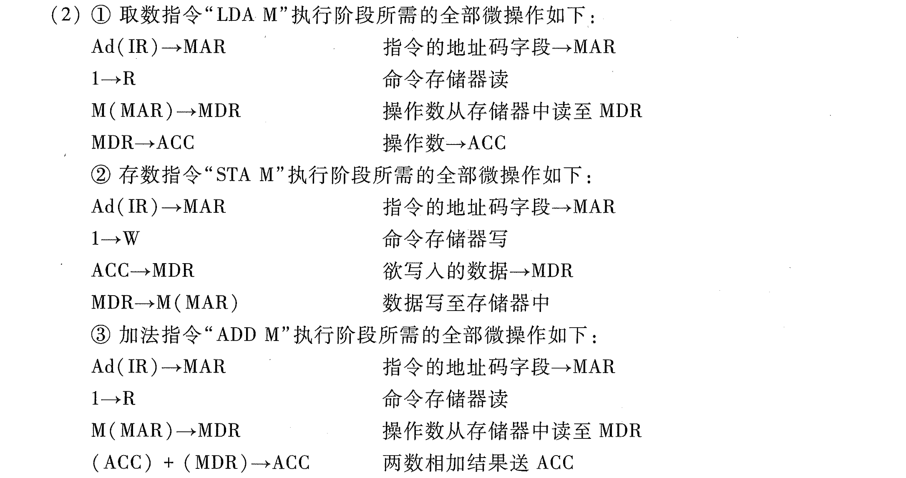
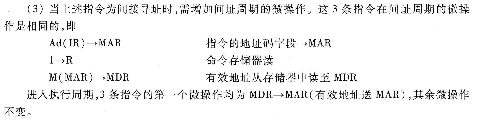
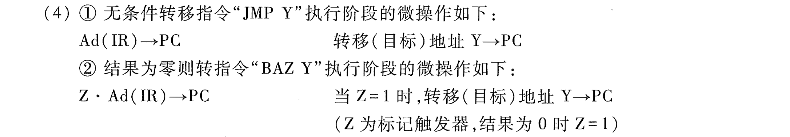

# e9.1-tang3-p382-微操作

## key

### IF | 取指周期

- IF(from, to) = IF(PC, IR)

| 微操作            | 说明             |
| -------------- | -------------- |
| PC -> MAR      | 现行指令地址 -> MAR  |
| 1 -> R         | 命令存储器读         |
| M(MAR) -> MDR  | 现行指令从存储器中读至MDR |
| MDR -> IR      | 现行指令 -> IR     |
| OP(IR) -> CU   | 指令的操作码 -> CU译码 |
| (PC) + 1 -> PC | 形成下一条指令的地址     |

---

- PC, Program Counter (the address of next instruction)
- R, Read
- MAR, Memory Address Register
- MDR, Memory Data Register
- IR, Instruction Register

### LDA & STA & ADD

#### LDA M | 取数指令

- LDA(from, to) = LDA(M(Ad(IR)), ACC)
	- LDA, Load, Accumulator

| 微操作            | 说明              |
| -------------- | --------------- |
| Ad(IR) - > MAR | 指令的地址码字段 -> MAR |
| 1 -> R         | 命令存储器读          |
| M(MAR) -> MDR  | 操作数从存储器中读至MDR   |
| MDR -> ACC     | 操作数 -> IR       |

#### STA M | 存数指令

- STA(from, to) = STA(ACC, M(Ad(IR)))
	- STA, Store, Accumulator

| 微操作            | 说明              |
| -------------- | --------------- |
| Ad(IR) - > MAR | 指令的地址码字段 -> MAR |
| 1 -> W         | 命令存储器写          |
| ACC -> MDR     | 欲写入的数据 -> MDR   |
| MDR -> M(MAR)  | 数据写至存储器中        |

#### ADD M | 加法指令

- ADD(from, to) = ADD(M(Ad(IR)), ACC)
	- ADD

| 微操作                  | 说明              |
| -------------------- | --------------- |
| Ad(IR) - > MAR       | 指令的地址码字段 -> MAR |
| 1 -> R               | 命令存储器读          |
| M(MAR) -> MDR        | 操作数从存储器中读至MDR   |
| (ACC) + (MDR) -> ACC | 两数相加结果送ACC      |

### 间址周期

| 微操作            | 说明                 |
| -------------- | ------------------ |
| **Ad(IR) - > MAR** | **指令的地址码字段 -> MAR**    |
| **1 -> R**         | **命令存储器读**             |
| **M(MAR) -> MDR**  | **有效地址（EA）从存储器中读至MDR** |
| MDR -> MAR     | 有效地址->MAR          |

加粗的部分是间址周期，最后一个微操作属于执行周期。

### 转移指令

#### JMP Y | 无条件转移指令

- JMP(from, to) = (Ad(IR), PC)
	- JMP, Jump

| 微操作           | 说明               |
| ------------- | ---------------- |
| Ad(IR) - > PC | 转移（目标）地址 Y -> PC |

#### BAZ Y | 结果为0则转指令

- BAZ(from, to) = (Ad(IR), PC)
	- BAZ, Branch if Accumulator is Zero

| 微操作               | 说明                     |
| ----------------- | ---------------------- |
| Z * Ad(IR) - > PC | 当Z=1时，转移（目标）地址 Y -> PC |
|                   | Z为标记触发器，结果为 0 时 Z = 1  |

