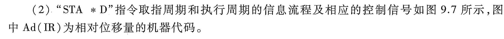

# e9.2-tang3-p383-控制信号

| 符号    | 说明      |
| ----- | ------- |
| M     | 主存      |
| XR    | 变址寄存器   |
| EAR   | 有效地址寄存器 |
| LATCH | 锁存器     |
| X     | 变址寄存器   |
| D     | 形式地址    |

## sol

### IF

- IF(from, to) = IF(PC, IR)

| 微操作              | 控制信号                                                                  |
| ---------------- | --------------------------------------------------------------------- |
| PC -> Bus -> MAR | $\text{PC}_{o},\text{MAR}_{i}$                                        |
| M(MAR) -> MDR    | $\text{MAR}_{o},\text{R}/\overline{\text{W}}=\text{R},\text{MDR}_{i}$ |
| MDR -> Bus -> IR | $\text{MDR}_{o},\text{IR}_{i}$                                        |
| (PC) + 1 -> PC   | +1                                                                    |

## key

### ADD X, D

| 微操作                  | 控制信号                                                                  |
| -------------------- | --------------------------------------------------------------------- |
| (XR) + Ad(IR) -> EAR | $\text{XR}_{o},\text{Ad(IR)}_{o},+,\text{EAR}_{i}$                    |
| EAR -> Bus -> MAR    | $\text{EAR}_{o},\text{MAR}_{i}$                                       |
| M(MAR) -> MDR        | $\text{MAR}_{o},\text{R}/\overline{\text{W}}=\text{R},\text{MDR}_{i}$ |
| MDR -> Bus -> X      | $\text{MDR}_{o},\text{X}_{i}$                                         |
| (ACC)+(X)->LATCH     | $\text{ACC}_{o},\text{X}_{o},\text{K}_i=+,\text{LATCH}_i$             |
| LATCH -> Bus -> ACC  | $\text{LATCH}_{o},\text{ACC}_{i}$                                     |

### STA * D

| 微操作                  | 控制信号                                                                             |
| -------------------- | -------------------------------------------------------------------------------- |
| (PC) + Ad(IR) -> EAR | $\text{PC}_{o},\text{AD(IR)}_{o},+,\text{EAR}_{i}$                               |
| EAR -> Bus -> MAR    | $\text{EAR}_{o},\text{MAR}_{i}$                                                  |
| ACC -> Bus -> MDR    | $\text{ACC}_{o},\text{MDR}_{i}$                                                  |
| MDR -> M(MAR)        | $\text{MDR}_{o},\text{MAR}_{o},\text{R}/\overline{\text{W}}=\overline{\text{W}}$ |

