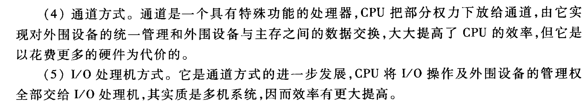

# IO控制方式 ch05-03-tang3-p210

> 5.2 简要说明CPU与I/O设备之间传递信息可采用哪几种联络方式，它们分别用于什么场合。
> **5.3 I/O设备与主机交换信息时，共有哪几种控制方式？简述它们的特点。**

- [IO2CPU-tang2psets.pdf](assets/IO2CPU-tang2psets.pdf)
- [IO2CPU-tang3.pdf](assets/IO2CPU-tang3.pdf)
	- [polling-tang3.pdf](assets/polling-tang3.pdf)
	- [interrupt-tang3.pdf](assets/interrupt-tang3.pdf)
	- [DMA-tang3.pdf](assets/DMA-tang3.pdf)

##  控制方式及其特点 (5.4.3.3-tang2psets-p112p118)

> I/O与主机交换信息有哪几种控制方式？各有何特点？

主机与 I/O 交换信息的控制方式有：

**（1）程序查询方式**  
其特点是主机与 I/O 串行工作。CPU 启动 I/O 后，时刻查询 I/O 是否准备好，若设备准备就绪，CPU 便转入处理 I/O 与主机间传送信息的程序；若设备未做好准备，则 CPU 反复查询，“踏步”等待直到 I/O 准备就绪为止。可见这种方式 CPU 效率很低。

**（2）程序中断方式**  
其特点是主机与 I/O 并行工作。CPU 启动 I/O 后，不必时刻查询 I/O 是否准备好，而是继续执行程序。当 I/O 准备就绪时，向 CPU 发中断请求信号，CPU 在适当的时候响应 I/O 的中断请求，暂停现行程序为 I/O 服务。这种方式消除了“踏步”现象，提高了 CPU 的效率。

**（3）DMA 方式**  
其特点是主机与 I/O 并行工作，主存和 I/O 之间有一条直接数据通路。CPU 启动 I/O 后，不必查询 I/O 是否准备好，当 I/O 准备就绪后，发出 DMA 请求，此时 CPU 不直接参与 I/O 和主存间的信息交换，只是把外部总线（地址线、数据线及有关控制线）的使用权暂时交付予 DMA，仍然可以完成自身内部的操作（如加法、移位等），故不必中断现行程序，只需暂停一个存取周期访存（即周期挪用），CPU 的效率更高。

**（4）通道方式**  
通道是一个具有特功能的处理器，CPU 把部分权力下放给通道，由它实现对外围设备的统一管理和外围设备与主存之间的数据交换，大大提高了 CPU 的效率，但它是以花费更多的硬件为代价的。

**（5）I/O 处理机方式**  
它是通道方式的进一步发展，CPU 将 I/O 操作及外围设备的管理权全部交给 I/O 处理机，其实质是多机系统，因而效率有更大提高。

## 控制方式及其特点 (5.4.3.3-tang2psets-p112p119)

> 一般小型或微型机中，I/O与主机交换信息有几种方式？各有何特点？哪种方式CPU效率最高？

在小型或微型机中，I/O 与主机交换信息有三种方式：**程序查询方式**、**程序中断方式**和 **DMA 方式**，其中 **DMA 方式 CPU 效率最高**。三种方式的特点详见上题答案。