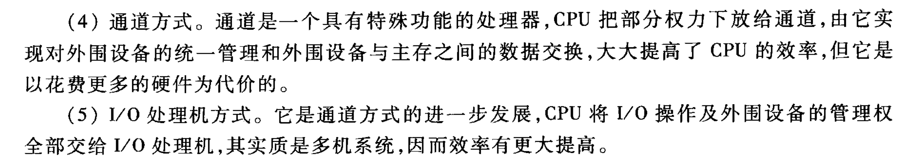

# IO控制方式

> 5.2 简要说明CPU与I/O设备之间传递信息可采用哪几种联络方式，它们分别用于什么场合。
> **5.3 I/O设备与主机交换信息时，共有哪几种控制方式？简述它们的特点。**
> 
> —— p5.3-tang3-p210

## 记忆
### 1. 联想记忆法

1. **程序查询方式**  
    ➤ 想象一个“守门员 CPU”不停地盯着门（设备），反复问：“好了没？好了没？” → **CPU傻等**  
    🔑 关键词：**串行、踏步等待、CPU效率低**
    
2. **程序中断方式**  
    ➤ 想象一个“忙碌的 CPU”，在干别的事，突然被拍肩：“I/O 好了！” → **打断现行程序、再处理 I/O**  
    🔑 关键词：**中断、并行、响应中断、效率提高**
    
3. **DMA 方式**  
    ➤ 想象 CPU 把钥匙交给 DMA：“你直接搬数据，我继续干我的事。” → **CPU 不管细节，忙别的事**  
    🔑 关键词：**DMA 请求、并行、周期挪用、CPU 效率更高**
    
4. **通道方式**  
    ➤ 想象 CPU 是一个老板，把 I/O 管理任务交给专门的“部门经理通道” → **授权部分任务**  
    🔑 关键词：**有专门处理器、统一管理、提高效率、硬件代价**
    
5. **I/O 处理机方式**  
    ➤ 想象 CPU 把所有 I/O 工作都甩给另一个“独立的副总经理” → **几乎不管 I/O，像两个 CPU 协作**  
    🔑 关键词：**I/O 完全独立、多机系统、效率最高**

### 2. 对比表格法

| 控制方式      | 是否并行 | CPU 是否介入传输 | 关键机制        | CPU效率 | 特点/缺点        |
| --------- | ---- | ---------- | ----------- | ----- | ------------ |
| 程序查询      | 否    | 全程介入       | 反复查询 I/O 状态 | 低     | 踏步等待，效率低     |
| 程序中断      | 是    | 响应中断时介入    | 中断请求机制      | 中     | 不再踏步，响应中断处理  |
| DMA       | 是    | 启动和授权时介入   | DMA 控制总线使用权 | 高     | 周期挪用，不中断程序   |
| 通道方式      | 是    | 启动后几乎不介入   | 通道独立管控设备    | 更高    | 类似子处理器，需硬件支持 |
| I/O 处理机方式 | 是    | 完全不介入      | 独立处理机       | 最高    | 多机系统，硬件最复杂   |

### 3. 口诀法：**“查断直通独立机”**

从最基础到最复杂，每个词记住一种方式：

> 🔁 **查断直通独立机**  
> ✨ 查：程序**查询**  
> ✨ 断：程序**中断**  
> ✨ 直：**DMA**（直接内存访问）  
> ✨ 通：**通道**方式  
> ✨ 独立机：**I/O 处理机**

可以理解为：

> “CPU 从全程查，到中断再查，到不查只授权，到让通道管理，再到自己退居幕后。”

### 4. 考场回忆流程

1. 脑中默念口诀：“查断直通独立机”
    
2. 快速想象五个场景（守门员、被打断、交钥匙、授权经理、甩锅副总）
    
3. 回忆关键词：串行/中断/DMA/通道/独立
    
4. 补充写出每种方式的优缺点

##  IO控制方式及其特点

> I/O与主机交换信息有哪几种控制方式？各有何特点？
> 
> —— 5.4.3.3-tang2psets-p112p118

主机与 I/O 交换信息的控制方式有：

1. **程序查询方式**：其特点是主机与 I/O 串行工作。CPU 启动 I/O 后，时刻查询 I/O 是否准备好，若设备准备就绪，CPU 便转入处理 I/O 与主机间传送信息的程序；若设备未做好准备，则 CPU 反复查询，“踏步”等待直到 I/O 准备就绪为止。可见这种方式 CPU 效率很低。
2. **程序中断方式**：其特点是主机与 I/O 并行工作。CPU 启动 I/O 后，不必时刻查询 I/O 是否准备好，而是继续执行程序。当 I/O 准备就绪时，向 CPU 发中断请求信号，CPU 在适当的时候响应 I/O 的中断请求，暂停现行程序为 I/O 服务。这种方式消除了“踏步”现象，提高了 CPU 的效率。
3. **DMA 方式**：其特点是主机与 I/O 并行工作，主存和 I/O 之间有一条直接数据通路。CPU 启动 I/O 后，不必查询 I/O 是否准备好，当 I/O 准备就绪后，发出 DMA 请求，此时 CPU 不直接参与 I/O 和主存间的信息交换，只是把外部总线（地址线、数据线及有关控制线）的使用权暂时交付予 DMA，仍然可以完成自身内部的操作（如加法、移位等），故不必中断现行程序，只需暂停一个存取周期访存（即周期挪用），CPU 的效率更高。
4. **通道方式**：通道是一个具有特功能的处理器，CPU 把部分权力下放给通道，由它实现对外围设备的统一管理和外围设备与主存之间的数据交换，大大提高了 CPU 的效率，但它是以花费更多的硬件为代价的。
5. **I/O 处理机方式**：它是通道方式的进一步发展，CPU 将 I/O 操作及外围设备的管理权全部交给 I/O 处理机，其实质是多机系统，因而效率有更大提高。

## IO控制方式及其特点

> 一般小型或微型机中，I/O与主机交换信息有几种方式？各有何特点？哪种方式CPU效率最高？
> 
> —— 5.4.3.3-tang2psets-p112p119

在小型或微型机中，I/O 与主机交换信息有三种方式：**程序查询方式**、**程序中断方式**和 **DMA 方式**，其中 **DMA 方式 CPU 效率最高**。三种方式的特点详见上题答案。