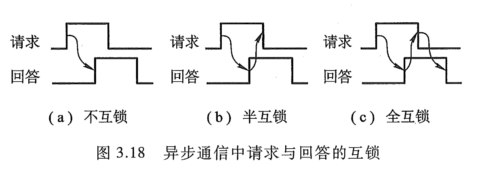
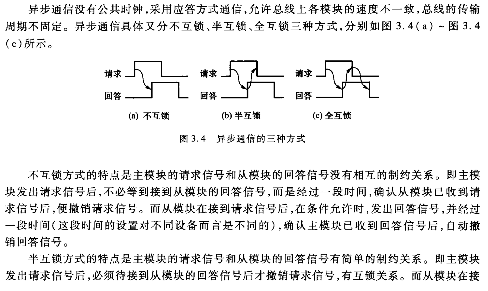
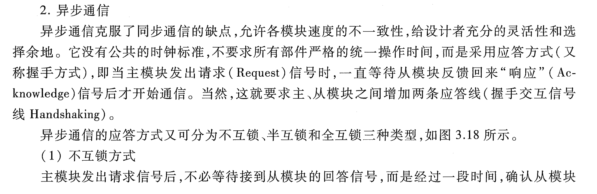

# 异步通信应答方式

> **3.7 画图说明异步通信中请求与回答有哪几种互锁关系。**

- 同步通信：公共时钟
- 异步通信：**应答 / 握手**方式（请求、回答），3种方式
	- (1') 不互锁方式：请求、回答（通信双方）**没有相互制约关系**。
		- (1') 主、从模块无需等待对方的回应，即可撤销自己的信号。
	- (1') 半互锁方式：请求、回答（通信双方）**有简单制约关系**。
		- (1') 主模块必须在从模块回答后才能撤销其请求信号，有一方互锁关系。而从模块的信号撤销则无需等待主模块。
	- (') 全互锁方式：请求、回答（通信双方）**有完全制约关系**。（可靠性最高）
		- (1') 主模块必须在从模块回答后才能撤销其请求信号；而从模块必须在主模块撤销请求信号后，才能撤销其回答信号。
	- 模块
		- 主模块 - 请求信号 - Request
		- 从模块 - 回答信号 - Acknowledge
		- 应答线 - 握手交互信号 - Handshaking

## 总线通信控制

> 什么是总线通信控制？为什么需要总线通信控制？
> 
> —— 3.4.3.4-tang2psets-p37p39

---

- 总线通信主要解决通信双方如何获知传输开始和传输结束，以及通信双方如何协调配合。
- 因为总线是众多部件共享的，在传送时间上只能用分时方式来解决，所以通信双方必须按某种约定的方式进行通信。

---

- 总线通信控制
	- 同步通信
	- **异步通信**
		- **应答方式**
			- **不互锁**
			- **半互锁**
			- **全互锁**
	- 半同步通信

## 异步通信 vs. 同步通信

> 3.6 试比较同步通信和异步通信
> 
> —— 3.6-tang3-p66

> 异步通信与同步通信的主要区别是什么？说明通信双方如何联络。
> 
> —— 3.4.3.6-tang2psets-p37p40

同步通信和异步通信的主要区别是前者有公共时钟，总线上的所有设备按统一的时序、统一的传输周期来进行信息传输，通信双方按约定好的时序联络；后者没有公共时钟，没有固定的传输周期，采用应答方式通信，具体的联络方式有不互锁、半互锁和全互锁三种。不互锁方式通信双方没有相互制约关系；半互锁方式通信双方有简单的制约关系；全互锁方式通信双方有完全的制约关系。其中全互锁通信可靠性最高。

## 异步通信

### tang2psets, p27

### tang3, p61

## others

[http://staff.ustc.edu.cn/~llxx/cod/courseware/2025/2025-14.pdf](http://staff.ustc.edu.cn/~llxx/cod/courseware/2025/2025-14.pdf)

---

[http://home.ustc.edu.cn/~louwenqi/courseware/Ch7.pdf](http://home.ustc.edu.cn/~louwenqi/courseware/Ch7.pdf)

---

[https://cs.nju.edu.cn/swang/CompArchOrg_13F/slides/lecture27.pdf](https://cs.nju.edu.cn/swang/CompArchOrg_13F/slides/lecture27.pdf)

---

[http://www.tup.tsinghua.edu.cn/upload/books/yz/076670-01.pdf](http://www.tup.tsinghua.edu.cn/upload/books/yz/076670-01.pdf)

---

[https://courses.cs.washington.edu/courses/cse410/01au/lectures/cse410-14-IOBus-6up.PDF](https://courses.cs.washington.edu/courses/cse410/01au/lectures/cse410-14-IOBus-6up.PDF)

---

[http://www.math.uaa.alaska.edu/~afkjm/cs221/handouts/ch3](http://www.math.uaa.alaska.edu/~afkjm/cs221/handouts/ch3)

