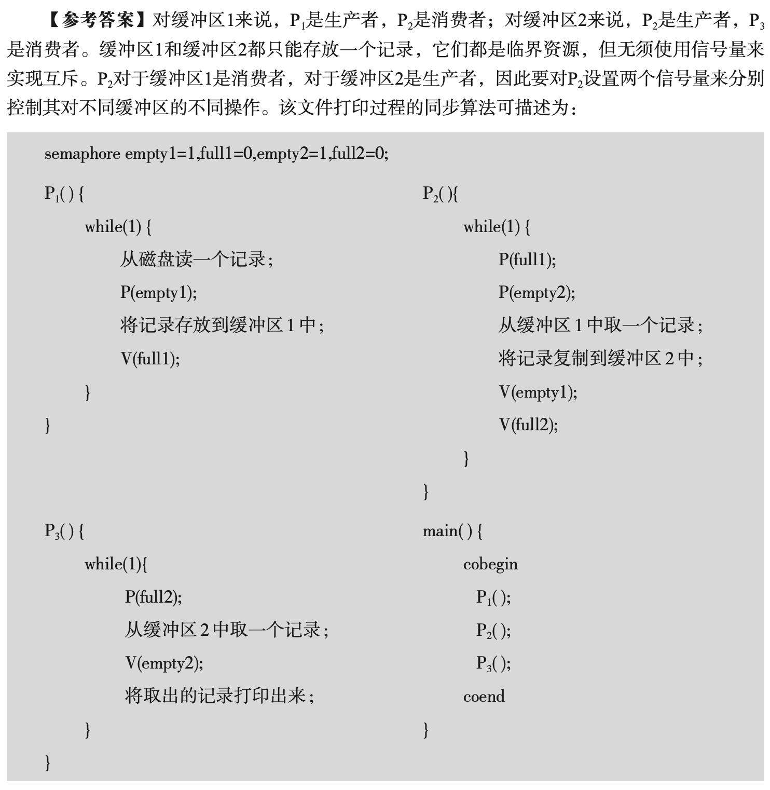

# 文件打印进程同步问题


有 3 个进程 P1、P2、P3 协作解决文件打印问题：

- **P1**：将文件记录从磁盘读入内存的缓冲区1。每次执行读一个记录。
    
- **P2**：将缓冲区1中的内容复制到缓冲区2中。每次执行复制一个记录。
    
- **P3**：将缓冲区2中的内容打印出来。每次执行打印一个记录。
    

缓冲区的大小与记录大小相同。请**用信号量机制**来保证文件的**正确打印顺序**。

## sol

```c
semaphore empty1 = 1, full1 = 0;
semaphore empty2 = 1, full2 = 0;

void P1() {
    // 从磁盘读出文件记录
    P(empty1);
    // 将文件记录写入缓冲区1
    V(full1);
}

void P2() {
    P(full1);
    P(empty2);
    // 从缓冲区1读出记录
    // 写入缓冲区2
    V(full2);
    V(empty1);
}

void P3() {
    P(full2);
    // 从缓冲区2读出记录
    V(empty2);
    // 打印文件记录
}

void main() {
    cobegin
        P1();
        P2();
        P3();
    coend
}
```

## key

> 对缓冲区1来说，P1 是生产者，P2 是消费者；  
> 对缓冲区2来说，P2 是生产者，P3 是消费者。
> 
> 缓冲区1和缓冲区2都只能存放一个记录，它们都是临界资源，但**无需使用信号量来实现互斥**。
> 
> P2 对于缓冲区1是消费者，对于缓冲区2是生产者，因此要对 P2 设置两个信号量，分别控制其对不同缓冲区的操作。
> 
> 该文件打印过程的同步算法可描述为：



关于P2的写法，**参考答案更符合通用的结构化同步习惯**，即所有 `P()` 操作在前（获得所有所需资源），所有 `V()` 操作在后（释放所有资源），这样代码的意图更清晰，也更容易做**死锁分析**。

- `P()` - 获取资源
- `V()` - 释放资源


