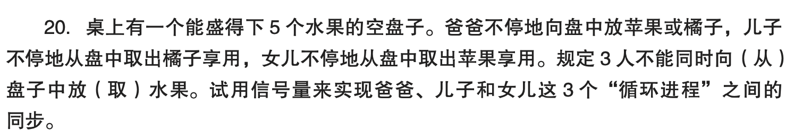
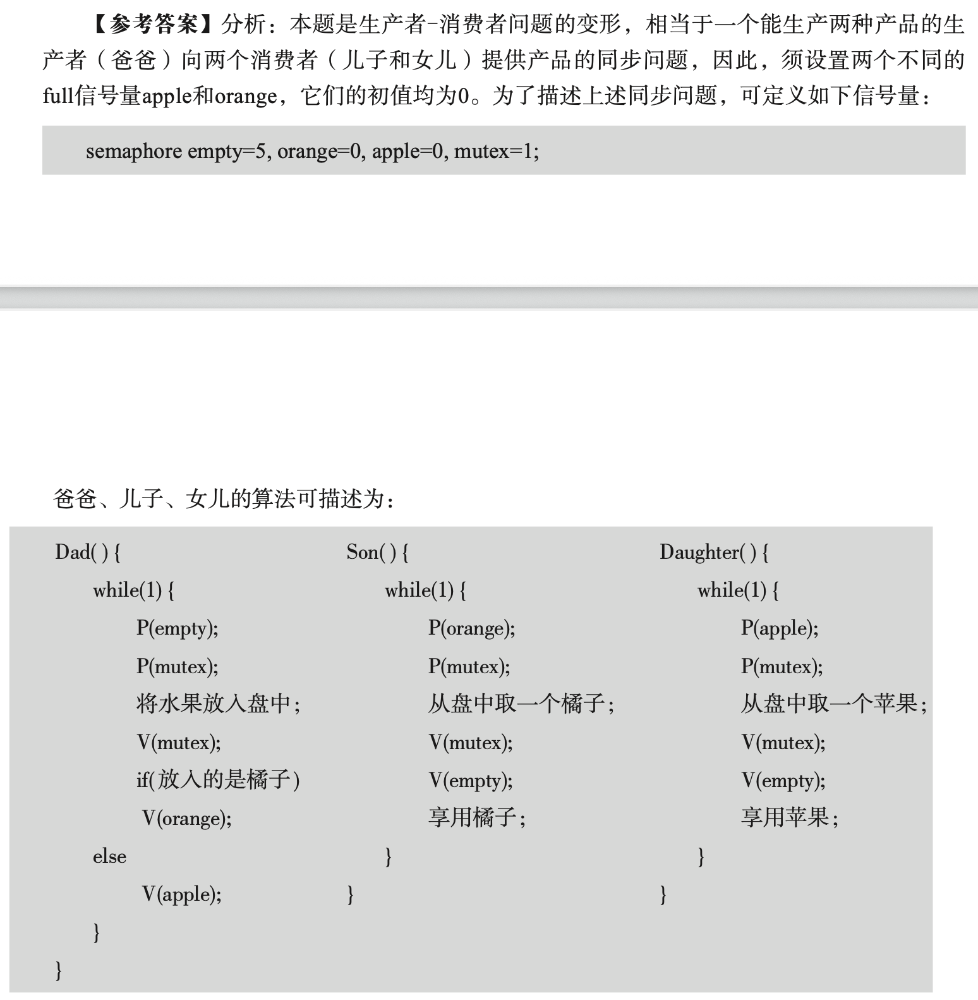

# 信号量同步问题



桌上有一个能盛得下 **5 个水果** 的空盘子。

- **爸爸** 不停地向盘中放入 **苹果或橘子**；
    
- **儿子** 不停地从盘中取出 **橘子** 并享用；
    
- **女儿** 不停地从盘中取出 **苹果** 并享用。
    

**规定**：3 人不能同时向盘中放水果或从盘中取水果（即对盘子的操作必须互斥）。

> 试用**信号量**来实现爸爸、儿子和女儿这 3 个“循环进程”之间的**同步**。

## sol

```c
semaphore mutex = 1, empty = 5;
semaphore orange = 0, apple = 0;

void Dad() {
	while (1) {
		P(empty);
		P(mutex);
		fruit = 随机选择(apple, orange);
		向盘中放水果;
		V(mutex);
		if (fruit == orange) V(orange);
		else V(apple);
	}
}

void Son() {
	while (1) {
		P(orange);
		P(mutex);
		从盘中取橘子;
		V(mutex);
		V(empty);
		享用橘子;
	}
}

void Daughter() {
	while (1) {
		P(apple);
		P(mutex);
		从盘中取苹果;
		V(mutex);
		V(empty);
		享用苹果;
	}
}
```

- `empty` - “空位”计数器
- `full` - “资源”信号量
	- `orange`
	- `apple`

## key



---

本题是**生产者-消费者问题**的一个变形。爸爸相当于一个能生产两种产品的**生产者**，分别向两个**消费者**（儿子和女儿）提供产品。

因此，需要设置两个不同的“**full**”型信号量 `apple` 和 `orange`，它们的初值均为 `0`，用于分别表示盘中苹果和橘子的数量。

为了描述同步问题，可定义如下信号量：

```c
semaphore empty = 5;     // 盘中空位数
semaphore orange = 0;    // 盘中橘子的数量
semaphore apple = 0;     // 盘中苹果的数量
semaphore mutex = 1;     // 互斥访问盘子
```

---

**爸爸、儿子、女儿的算法如下：**

```c
Dad() {
    while (1) {
        P(empty);
        P(mutex);

        // 将水果放入盘中
        if (放入的是橘子)
            V(orange);
        else
            V(apple);

        V(mutex);
    }
}
```

```c
Son() {
    while (1) {
        P(orange);
        P(mutex);

        // 从盘中取一个橘子
        V(mutex);
        V(empty);

        // 享用橘子
    }
}
```

```c
Daughter() {
    while (1) {
        P(apple);
        P(mutex);

        // 从盘中取一个苹果
        V(mutex);
        V(empty);

        // 享用苹果
    }
}
```
