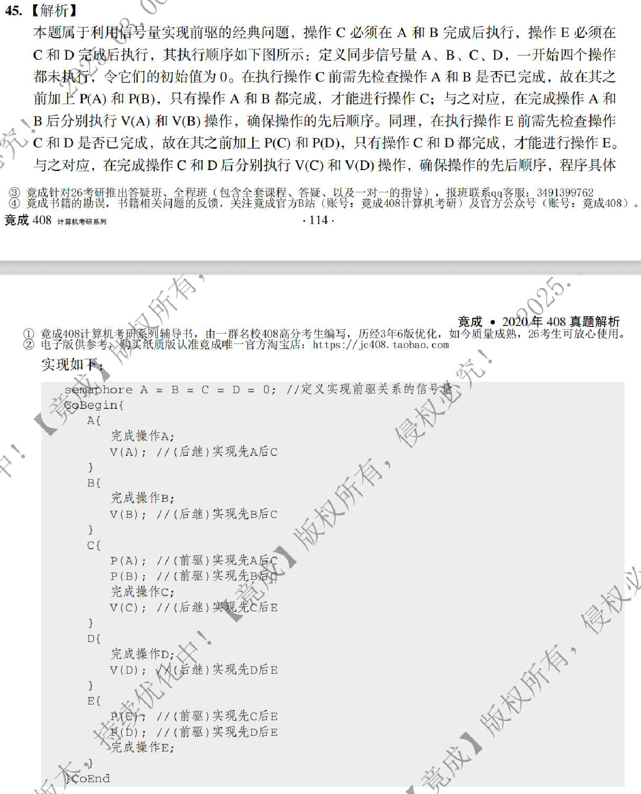

---
tags:
  - pv
---

## sol


```c
semahpore AC = BC = CE = DE = 0;

CoBegin {
	A {
		A完成操作;
		V(AC);
	}

	B {
		B完成操作;
		V(BC);
	}

	C {
		P(AC);
		P(BC);
		C完成操作;
		V(CE);
	}

	D {
		D完成操作;
		V(DE);
	}

	E {
		P(CE);
		P(DE);
		E完成操作;
	}
} CoEnd
```

## key


