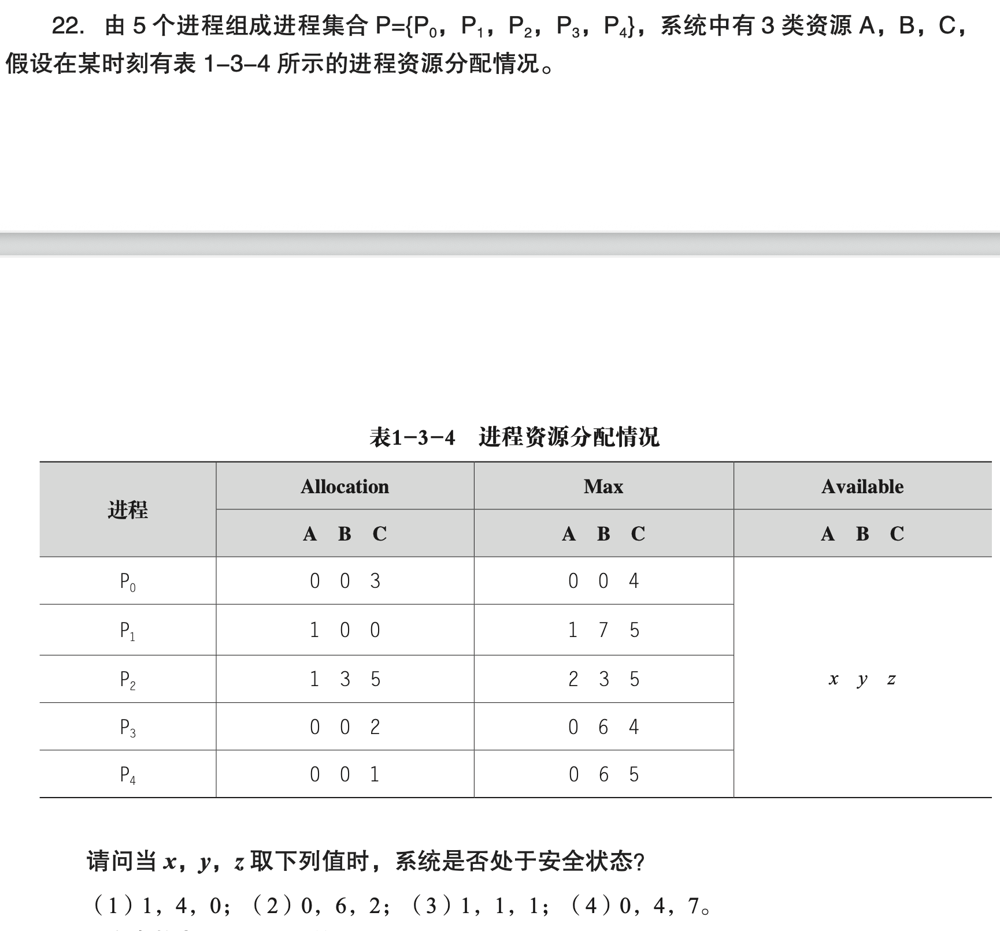

---
tags:
  - algorithm
date: 2025-06-02T09:46:00
---

# P1: Banker's Algorithm

## key words

- 进程 / 进程集合
- 资源
- 进程资源分配情况
- 银行家算法
- 安全状态 / 非安全状态 / 死锁

## other psets

- [https://www.csl.mtu.edu/cs4411.ck/www/HOMEWORK/HM1/hm1-sol.pdf](https://www.csl.mtu.edu/cs4411.ck/www/HOMEWORK/HM1/hm1-sol.pdf)

## Ex. 1 ch03-22-txdsol-p19

