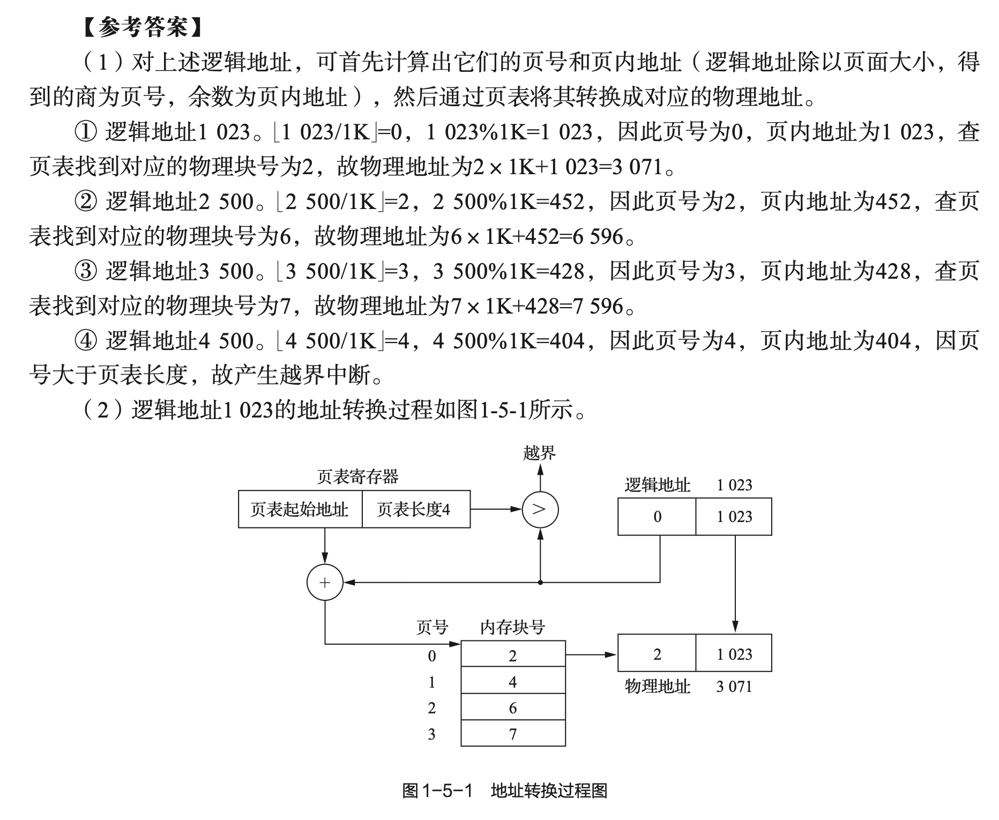
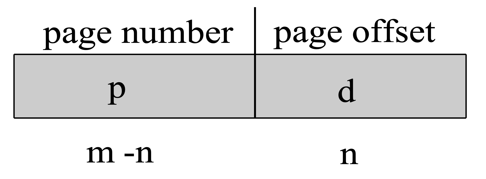
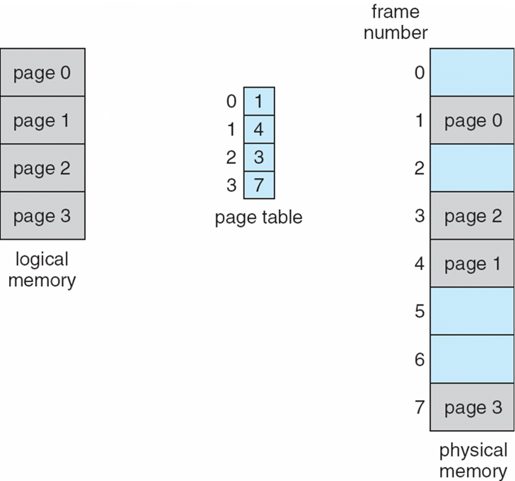
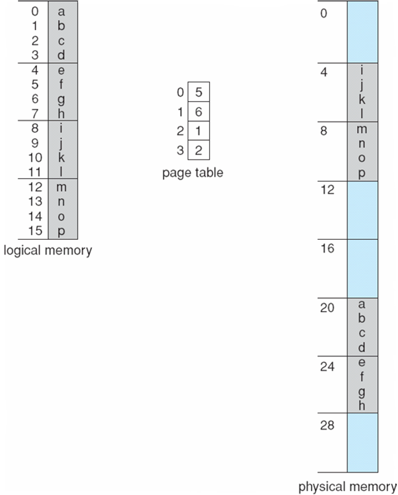
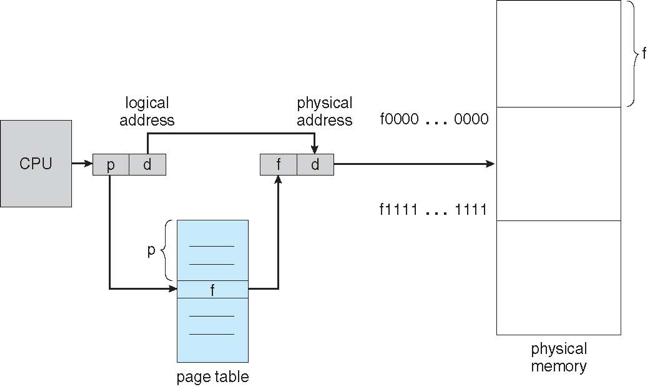
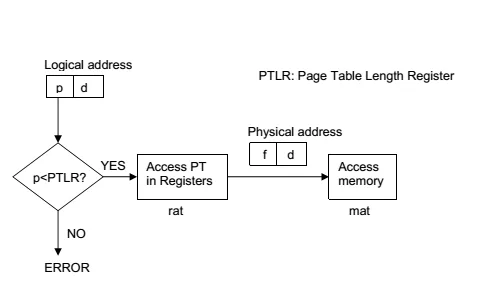

# Psets: Paging

## Ex. 1 ch05-15-txdsol-p33

Consider the following page table. All numbers in the table are decimal.

The memory is 64KB and page size is 1KB (10 bits).

| Page Number | Frame Number |
| ----------- | ------------ |
| 0           | 2            |
| 1           | 4            |
| 2           | 6            |
| 3           | 7            |

- (8') Given the physical address of each of the following logical addresses.
	- $1023_{10}$
	- $2500_{10}$
	- $3500_{10}$
	- $4500_{10}$
- (6') Given the address translation diagram of the logical address $1023_{10}$.

### Answer

$$
\frac{\text{logical address}}{\text{page size}}=\text{page number}\ \text{R}\ \text{offset}
$$

- $1023_{10}$
	- According to the formula, $\frac{1023}{1KB}=0\ \text{R}\ 1023$. Thus $1023_{10}$ has its page number 0 and offset 1023. Because the page number 0 has its page frame in frame 2, the physical address is (2, 1023), i.e. $3071=2\times 1024+1023$.
- $2500_{10}$
	- According to the formula, $\frac{2500}{1KB}=2\ \text{R}\ 452$. Thus $2500_{10}$ has its page number 2 and offset 452. Because the page number 2 has its page frame in frame 6, the physical address is (6, 452), i.e. $6596=6\times 1024+452$.
- $3500_{10}$
	- According to the formula, $\frac{3500}{1KB}=3\ \text{R}\ 428$. Thus $3500_{10}$ has its page number 3 and offset 428. Because the page number 3 has its page frame in frame 7, the physical address is (7, 428), i.e. $7596=7\times 1024+428$.
- $4500_{10}$
	- According to the formula, $\frac{4500}{1KB}=4\ \text{R}\ 404$. Thus $4500_{10}$ has its page number 4 and offset 404. because the page number 4 has no entry in the page table, and hence this is an invalid address.

| logical address | p: page number | d: offset | f: frame number                  | physical address                                            |
| --------------- | -------------- | --------- | -------------------------------- | ----------------------------------------------------------- |
| 1023            | 0              | 1023      | 2                                | 3071                                                        |
| 2500            | 2              | 452       | 6                                | 6596                                                        |
| 3500            | 3              | 428       | 7                                | 7596                                                        |
| 4500            | **4**          | 404       | p has no entry in the page table | an invalid address has no physical address (boundary error) |

---

---

### Summary

#### logical address

- Page Size = $2^{\text{number of offset bits}}$
- Number of pages = $2^{\text{number of page number bits}}$

#### paging

####  address translation by Memory Management Unit (MMU)

---

---

[https://gist.nju.edu.cn/course-slides/os25/3_memory.pdf](https://gist.nju.edu.cn/course-slides/os25/3_memory.pdf)

