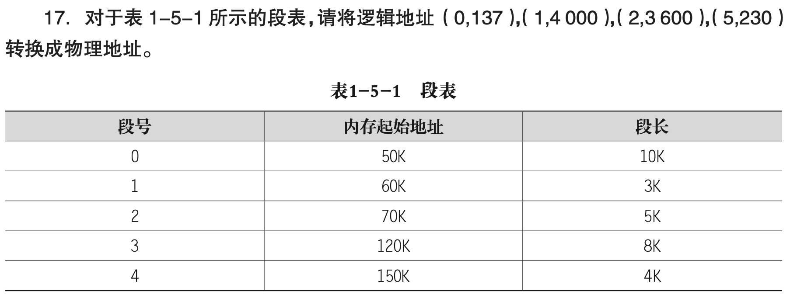
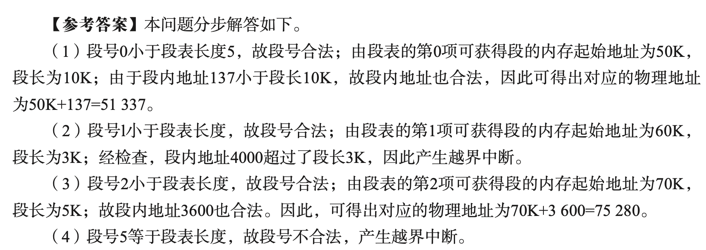

segment
# Psets: Segmentation

## Ex. 1 ch05-17-txdsol-p34

Consider the following segment table:

| Segment | Base | Length |
| ------- | ---- | ------ |
| 0       | 50K  | 10K    |
| 1       | 60K  | 3K     |
| 2       | 70K  | 5K     |
| 3       | 120K | 8K     |
| 4       | 150K | 4K     |

What are the physical addresses for each of the following logical addresses?

- 0, 137
- 1, 4000
- 2, 3600
- 5, 230

All values are in decimal.

### Answer

- 0, 137
	- The segment number and offset of (0, 137) are 0 and 137, respectively. Segment 0 has its base address 50K and length 10K. Because offset 137 < 10K, this is a valid address and the physical address is 51337 = 50K(base) + 137.
- 1, 4000
	- The segment number and offset of (1, 4000) are 1 and 4000, respectively. Because the offset 4000 is larger than length of segment 1 (i.e., 3K), this is an invalid address.
- 2, 3600
	- The segment number and offset of (2, 3600) are 2 and 3600, respectively. Segment 2 has its base address 70K and length 5K. Because offset 3600 < 5K, this is a valid address and the physical address is 75280 = 70K(base) + 3600.
- 5, 230
	- This address refers to segment 5 and offset 230. Segment 5 has no entry in the segment table, and hence this is an invalid address.

---

### Summary

- s: segment number
- d: offset
- trap: addressing error / boundary error

---

[https://gist.nju.edu.cn/course-slides/os25/3_memory.pdf](https://gist.nju.edu.cn/course-slides/os25/3_memory.pdf)

---