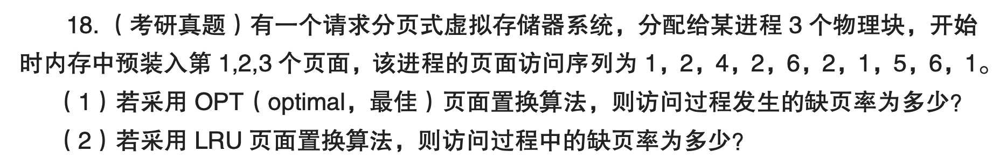
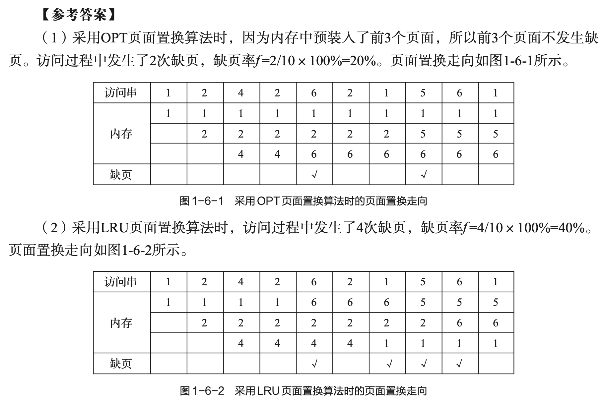

---
tags:
  - final-zzx
  - psets
---

# P3: Page Replacement | 页面置换算法

- [page-replacement-OS-JC-250220.pdf](page-replacement-OS-JC-250220.pdf)
- [https://page-replacement.fun/](https://page-replacement.fun/)
- [https://os.seofernando.com/tools/page-replacement](https://os.seofernando.com/tools/page-replacement)

## Ex. 1 页面置换算法分析
 
在请求分页存储管理系统中，假设某作业的页面访问序列为：

```
7, 0, 1, 2, 0, 3, 0, 4, 2, 3, 0, 3, 2, 1, 2, 0, 1, 7, 0, 1
```

系统分配给该作业的**物理块数为3**，请分别采用以下三种常见的页面置换算法进行分析。

#### **（1）最佳置换算法（OPT）（4分）**

请根据上述页面访问序列和物理块数，画出采用**最佳置换算法**（OPT）时的页面置换过程图。（2分）

请填写以下空格：

- 缺页中断次数：_______（1分）
    
- 页面置换次数：_______（1分）
    

---

#### **（2）先进先出算法（FIFO）（4分）**

请根据上述页面访问序列和物理块数，画出采用**先进先出算法**（FIFO）时的页面置换过程图。（2分）

请填写以下空格：

- 缺页中断次数：_______（1分）
    
- 页面置换次数：_______（1分）
    

---

#### **（3）最近最久未使用算法（LRU）（4分）**

请根据上述页面访问序列和物理块数，画出采用**最近最久未使用算法**（LRU）时的页面置换过程图。（2分）

请填写以下空格：

- 缺页中断次数：_______（1分）
    
- 页面置换次数：_______（1分）
    

---

### **参考答案**

页面访问序列：  
`7 0 1 2 0 3 0 4 2 3 0 3 2 1 2 0 1 7 0 1`  
物理块数：3

---

#### **（1）OPT 最佳置换算法**

**页面置换过程图（每列表示当前页面，替换时标记）：**

```
时间：   1  2  3  4  5  6  7  8  9 10 11 12 13 14 15 16 17 18 19 20
页面：   7  0  1  2  *  3  *  4  *  3  *   =  =   1  =   =   =   7  =   = 
```

**缺页中断次数：** 9  
**页面置换次数：** 6

---

#### **（2）FIFO 先进先出算法**

**页面置换过程图：**

```
时间：   1  2  3  4  5  6  7  8  9 10 11 12 13 14 15 16 17 18 19 20
页面：   7  0  1  2  *  3  *  4  *  3  *   =  =   1  *   0  =   7  *   1
```

**缺页中断次数：** 15  
**页面置换次数：** 12

---

#### **（3）LRU 最近最久未使用算法**

**页面置换过程图：**

```
时间：   1  2  3  4  5  6  7  8  9 10 11 12 13 14 15 16 17 18 19 20
页面：   7  0  1  2  *  3  *  4  *  3  *   =  =   1  *   0  =   7  *   1
```

**缺页中断次数：** 12  
**页面置换次数：** 9

## Ex. 2 ch06-18-txdsol-p41



```
1 2 4 2 6 2 1 5 6 1
```

### computation outline


([img src](https://pralgorithms.bhaskarrijal.me/))

### OPT


([img src](https://songthun.github.io/Page-Replacement-Solver/))

---


([img src](https://os-project-page-replacement.vercel.app/))

---


([img src](https://page-replacement-by-thrillim.vercel.app/))

---


([img src](https://nicomedes.codia.space/app/os/page_replacement))

### LRU


---


---


---




