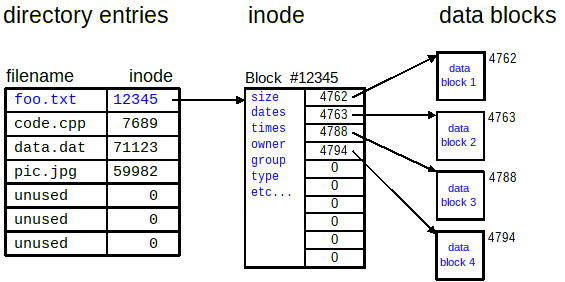

---
tags:
  - cal-zzx
---

# Dir, FCB, inode

## ch08-14-txdsol-p53

## 题目回顾

- 每个盘块大小：512B
    
- 每个文件的 FCB（File Control Block）大小：64B
    
- FCB 中文件名占 8B
    
- 引入索引节点后，每个目录项包含文件名（8B）+ 索引节点编号（2B）= 10B
    
- 目录项总数：256 个
    

目标是比较**引入索引节点前后**，**查找某文件的 FCB 平均需启动磁盘的次数**。

---

## 一、引入索引节点**之前**

### 组织方式

- 每个目录项包含整个 FCB（即 64B）。
- 所有目录项连在一起，形成一个目录文件，存在磁盘上。
- 所以整个目录大小为：$256 \times 64\text{B} = 16384\text{B}$
- 每个盘块大小为 512B：$\frac{16384}{512} = 32 \text{个盘块}$

### 查找过程

- 线性搜索：最坏情况下查到最后，平均查找半数。
    
- 每访问一个目录项可能都需要访问不同的盘块（因为文件按块存储）。
    
- 所以平均需要读取的盘块数量是：$\frac{32 + 1}{2} = 16.5 \approx 17 \text{次磁盘启动}$

---

## 二、引入索引节点**之后**

### 目录项变小

- 每个目录项只存放**文件名（8B）+ 索引节点编号（2B）** = 10B。
- 所以整个目录文件大小为：$256 \times 10\text{B} = 2560\text{B}$
- 所占盘块数：$\left\lceil \frac{2560}{512} \right\rceil = 5 \text{个盘块}$

### 查找过程

- 线性搜索，平均查找代价：$\frac{5 + 1}{2} = 3 \text{次磁盘启动}$
- 但每个目录项只含索引节点编号，还需要额外读取该索引节点：
    - 需要**再启动一次磁盘**去读取该索引节点。

### 磁盘总启动次数

$$
3 + 1 = 4 \text{次}
$$

---

## 总结

### 1. **文件控制块（FCB）**

- 是描述文件元信息的数据结构，例如文件名、大小、时间戳、数据块指针等。
    
- 存储在磁盘上。
    

### 2. **索引节点（inode）**

- 是 FCB 的抽象形式，常见于 Unix/Linux 文件系统。
    
- 每个文件在磁盘中只有一个 inode，目录项仅保存文件名和 inode 编号。
    

### 3. **目录结构**

- **无索引节点：** 目录项直接存放 FCB，信息完整，但冗余高。
    
- **有索引节点：** 目录项只含文件名 + inode 编号，**需额外读取 inode**，但整体效率更高。
    

### 4. **磁盘访问代价计算（平均启动次数）**

- 文件存储在多个盘块中。
    
- 若线性查找，访问的盘块数量平均为：$\frac{\text{总盘块数} + 1}{2}$

---

## 结论

|情况|目录占盘块数|平均查找盘块数|额外磁盘启动|总平均磁盘启动次数|
|---|---|---|---|---|
|无索引节点|32|(32 + 1)/2 = 16.5 ≈ 17|0|17|
|有索引节点|5|(5 + 1)/2 = 3|+1|4|

**引入索引节点后，磁盘访问次数显著减少，提高了文件查找效率。**
