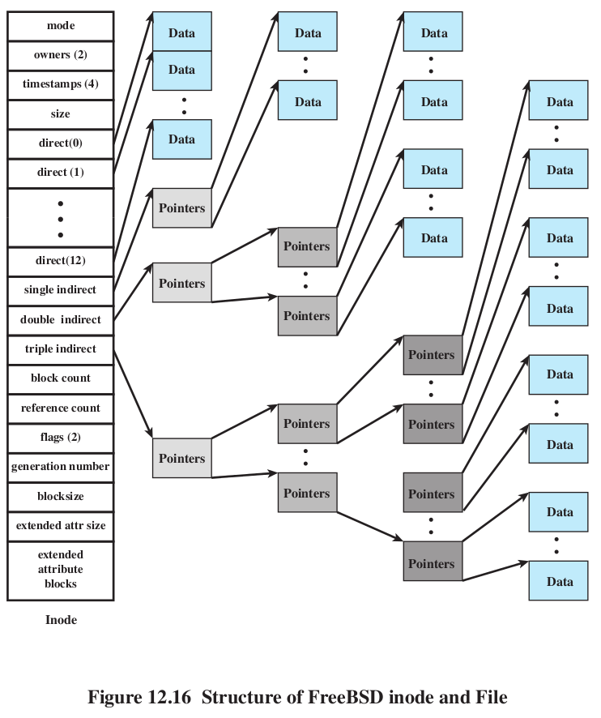
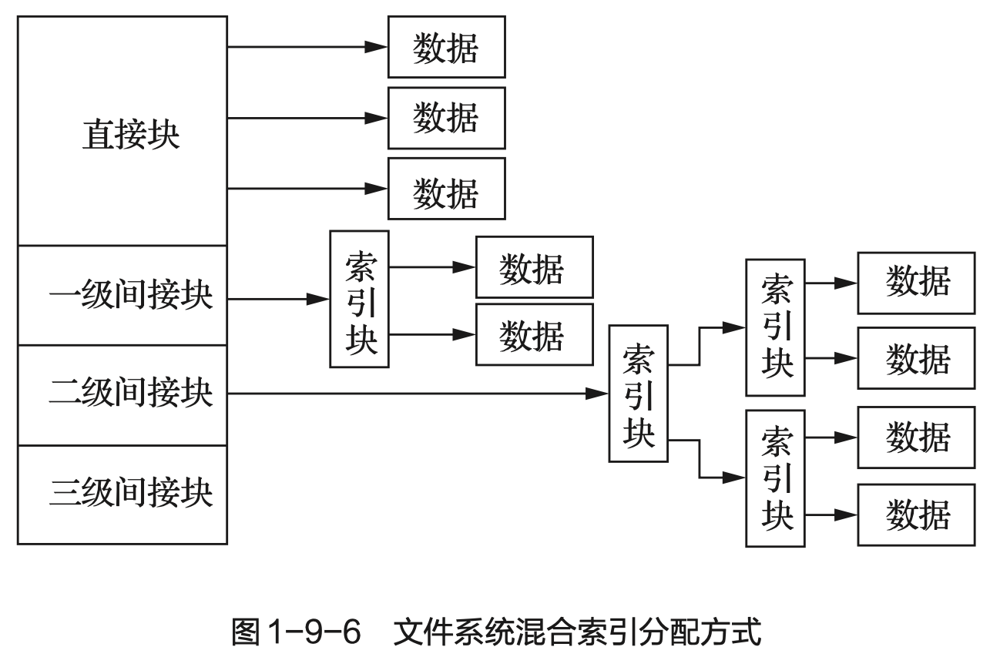
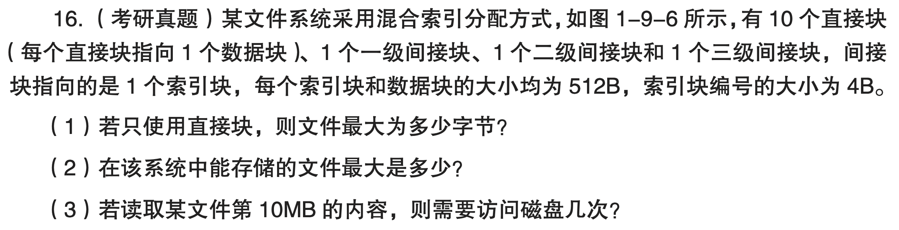
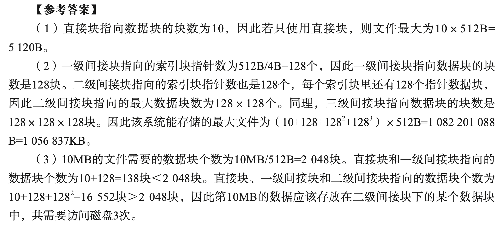
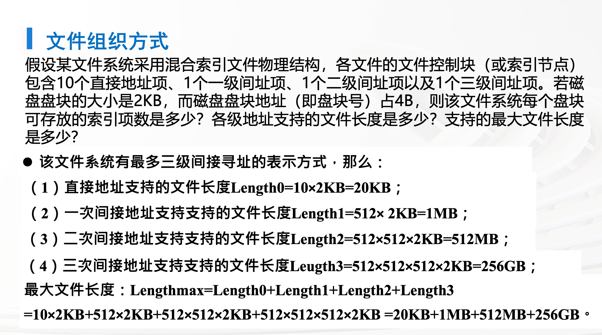

# 混合索引分配的计算

- [混合索引分配的计算-JC25-OS.pdf](assets/混合索引分配的计算-JC25-OS.pdf)
	1. **文件最大长度**：$(a+b\times\frac{n}{m}+c\times(\frac{n}{m})^2+d\times(\frac{n}{m})^3)\times n$
		1. $a$ —— direct —— 直接地址项数 / 直接地址索引数 / 直接索引指针个数
		2. $b$ —— single indirect —— 一次间址项数 / 一级间接地址索引数 / 一级索引指针个数
		3. $c$ —— double indirect —— 二次间址项数 / 二级间接地址索引数 / 二级索引指针个数
		4. d —— trible indirect
		5. $m$ —— entry size —— 盘块号大小 / 地址项大小 / 索引指针大小
		6. $n$ —— block size —— 盘块大小 / 磁盘索引块大小 / 磁盘数据块大小 / 磁盘块大小
	2. **偏移量的访盘次数**
		1. x 级索引需访盘 x+1 次
			1. (0) direct —— 1次
			2. (1) single indirect —— 2次
			3. (2) double indirect —— 3次

---

## Ex. 1 ch09-16-txdsol-p59

## Ex. 2 psets-zzx

