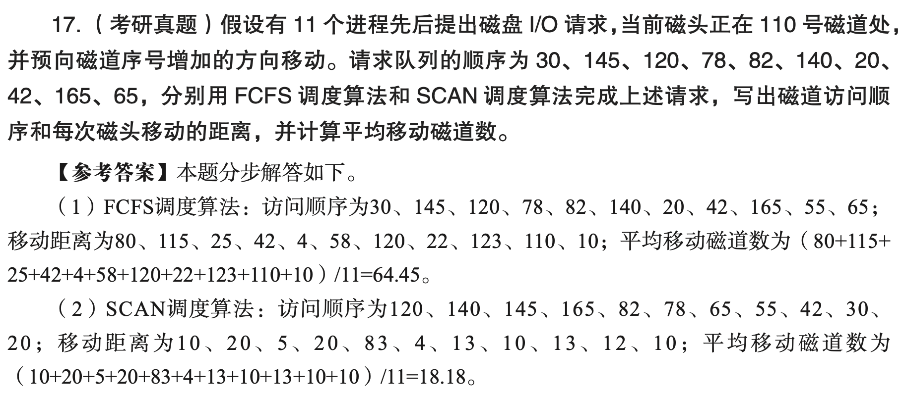

---
tags:
  - final-zzx
  - psets
---

# Psets: Disk Scheduling

## Overview

1. **FCFS**
2. **SSTF**
3. SCAN
4. CSCAN
5. LOOK
6. CLOOK

## Tools

- [https://disk-scheduling-algorithms-visualizer.netlify.app/](https://disk-scheduling-algorithms-visualizer.netlify.app/)
- [https://khushalip.github.io/OS-lab/diskAlgo/disk.html](https://khushalip.github.io/OS-lab/diskAlgo/disk.html)
- [https://www.algorithmroom.com/calculator/disk-scheduling](https://www.algorithmroom.com/calculator/disk-scheduling)

## Posts

- [https://www.101computing.net/disk-scheduling-algorithms/](https://www.101computing.net/disk-scheduling-algorithms/)

## Terms

- 磁盘调度
- 请求序列 / 磁道请求访问序列 / 磁盘请求服务队列
- 初始磁头位置
- 磁头服务顺序 / 磁头移动顺序
- 磁头总移动磁道数

## Ex. 1 ch07-18-txdsol-p47

| the initial head position | the request sequence            |
| ------------------------- | ------------------------------- |
| 30                        | 38, 6, 37, 100, 14, 124, 65, 67 |

### FCFS

- Total seek time is:  391
- Sequence of execution: 30, 38, 6, 37, 100, 14, 124, 65, 67
- Average seek time:  48.88

### SSTF

- Total seek time is: 158
- Sequence of execution: 30, 37, 38, 14, 6, 65, 67, 100, 124
- Average seek time:  19.75

### LOOK

- Total seek time is: 212
- Sequence of execution: 30, 37, 38, 65, 67, 100, 124, 14, 6
- Average seek time:  26.50

## Ex. 2 ch07-17-txdsol-p47

| the initial head position | the request sequence                           |
| ------------------------- | ---------------------------------------------- |
| 110                       | 30, 145, 120, 78, 82, 140, 20, 42, 165, 55, 65 |

### FCFS

- Total seek count is: 709
- Sequence of operations' processing: 110, 30, 145, 120, 78, 82, 140, 20, 42, 165, 55, 65
- Average seek count is: 64.45454545

(img src: [https://khushalip.github.io/OS-lab/diskAlgo/disk.html](https://khushalip.github.io/OS-lab/diskAlgo/disk.html))

### LOOK

- Total seek time is: 200
- Sequence of execution: 110, 120, 140, 145, 165, 82, 78, 65, 55, 42, 30, 20
- Average seek time:  18.18

