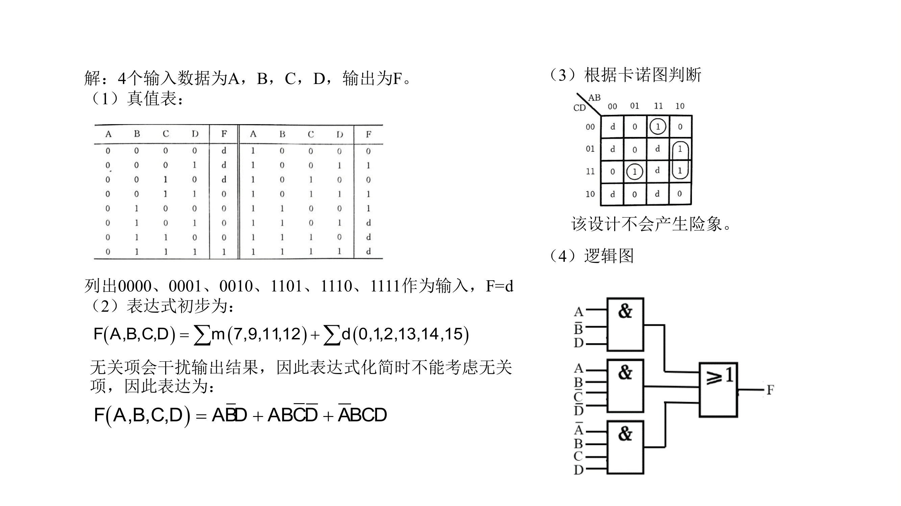
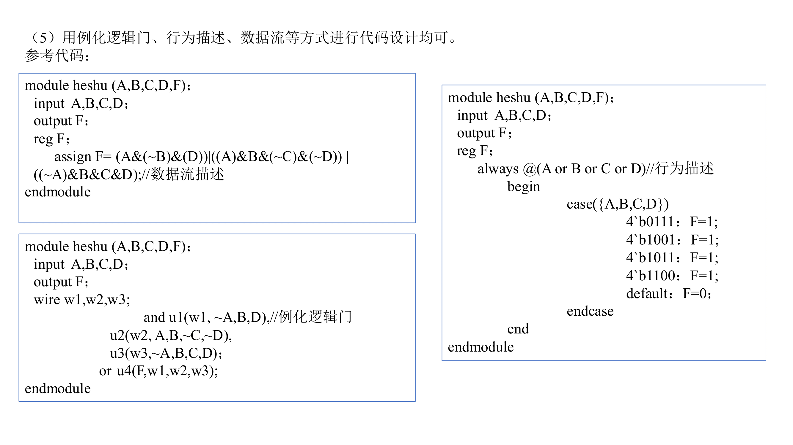

# 基于余3码的合数判断组合逻辑电路设计







> 设计一个**组合逻辑电路**，用于判断用**余3码（Excess-3 code）**表示的**1位十进制数**是否为**合数**。  注：合数是指**大于1且除了能被1和自身整除外，还能被其他正整数整除的自然数**。

**要求完成以下任务（共20分）：**

1. 列出该电路的**真值表**；
    
2. 写出电路的**逻辑表达式**（提示：请判断无关项是否对输出有干扰，并予以合理处理）；
    
3. 判断所设计的电路是否存在**冒险（Hazard）**现象，如存在，请给出**消除方案**；
    
4. 绘制电路的**逻辑图**；
    
5. 编写相应的**Verilog HDL 模块代码**。

## sol

设四个输出数据分别为 $B_3$，$B_2$，$B_1$，$B_0$，输出为 $F$。

### 1. 真值表

输入：用余3码表示的1位十进制数
输出：1表示是合数，0表示不是合数

| $B_3B_2B_1B_0$ | $F$   | BCD   | 编号     |
| -------------- | ----- | ----- | ------ |
| **0000**       | **d** |       | 0      |
| **0001**       | **d** |       | 1      |
| **0010**       | **d** |       | 2      |
| 0011           | 0     | 0     | 3      |
| 0100           | 0     | 1     | 4      |
| 0101           | 0     | 2     | 5      |
| 0110           | 0     | 3     | 6      |
| **0111**       | **1** | **4** | **7**  |
| 1000           | 0     | 5     | 8      |
| **1001**       | **1** | **6** | **9**  |
| 1010           | 0     | 7     | 10     |
| **1011**       | **1** | **8** | **11** |
| **1100**       | **1** | **9** | **12** |
| **1101**           | **d**     |       | 13     |
| **1110**           | **d**     |       | 14     |
| **1111**           | **d**     |       | 15     |


### 2. 表达式

$F(B_3,B_2,B_1,B_0)=\sum m(7,9,11,12)+\sum d(0,1,2,13,14,15)$


无关项会干扰输出结果，因此表达式化简时不能考虑无关项，因此表达式为：

$F(B_3,B_2,B_1,B_0)=B_3'B_2B_1B_0+B_3B_2'B_1'B_0+B_3B_2'B_1B_0+B_3B_2B_1'B_0'$


### 3. 卡诺图


根据K-Map判断，该设计不会产生险象。

$F(B_3,B_2,B_1,B_0)=B_3'B_2B_1B_0+B_3B_2'B_0+B_3B_2B_1'B_0'$

### 4. 电路图


### 5. Verilog

```verilog
// 纯数据流建模，组合逻辑
module heshu (
    input  wire A,
    input  wire B,
    input  wire C,
    input  wire D,
    output wire F
);

// 使用按位或 | 来组合多个满足条件的情况
assign F = (A & ~B & D) | (A & B & ~C & ~D) | (~A & B & C & D);

endmodule
```

```verilog
// 行为级建模
module heshu (
    input  wire A,
    input  wire B,
    input  wire C,
    input  wire D,
    output reg  F
);

always @(*) begin
    F = (A & ~B & D) | (A & B & ~C & ~D) | (~A & B & C & D);
end

endmodule
```

```verilog
// 行为描述
module heshu (
    input  wire A,
    input  wire B,
    input  wire C,
    input  wire D,
    output reg  F
);

always @(*) begin
    case ({A, B, C, D})
        4'b0111: F = 1;
        4'b1001: F = 1;
        4'b1011: F = 1;
        4'b1100: F = 1;
        default: F = 0;
    endcase
end

endmodule
```

```verilog
// 门级建模（gate-level modeling），例化逻辑门
module heshu (
    input  wire A,
    input  wire B,
    input  wire C,
    input  wire D,
    output wire F
);

wire nA, nC, nD;
wire w1, w2, w3;

// 先进行取反操作
not n1(nA, A);
not n2(nC, C);
not n3(nD, D);

// 逻辑门例化
and u1(w1, nA, B, D);        // (~A) & B & D
and u2(w2, A, B, nC, nD);    // A & B & ~C & ~D
and u3(w3, nA, B, C, D);     // ~A & B & C & D

or  u4(F, w1, w2, w3);       // F = w1 | w2 | w3

endmodule
```

