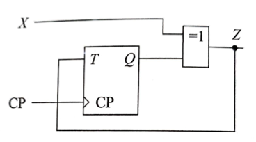
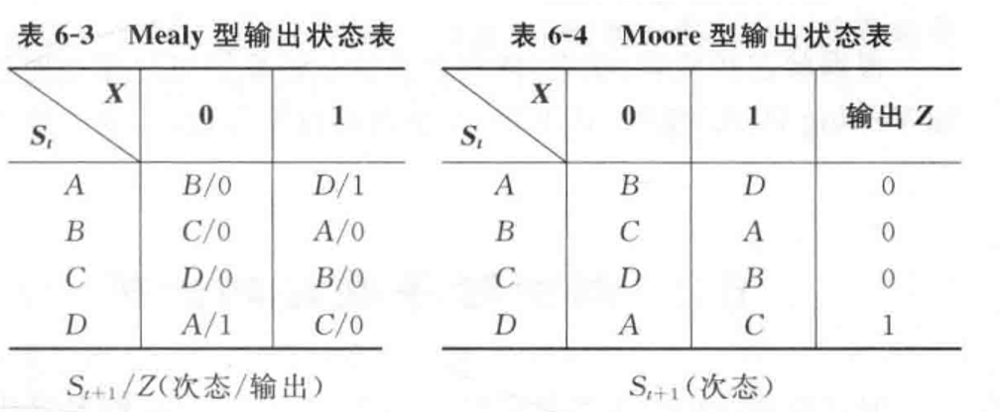
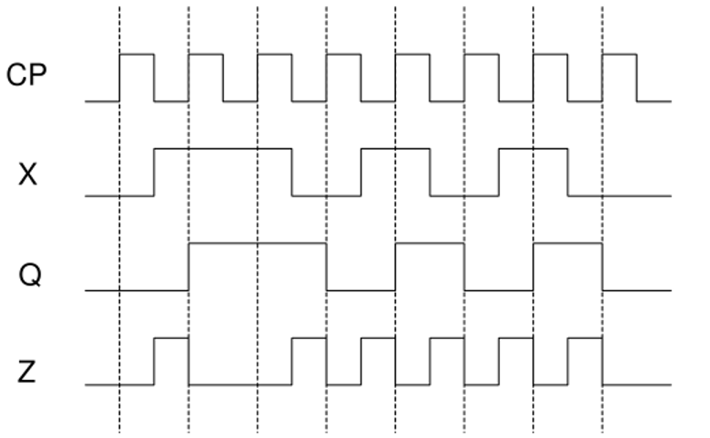

# SSLC 分析

> **分析下图所示的同步时序电路的逻辑功能。假设初始状态为 0，输入序列 X = 01101010，画出相应的时序波形图。**

**解题步骤：**

1. 判断电路类型：
    
    - 是**同步时序电路（Synchronous Sequential Circuit）**还是**异步时序电路（Asynchronous Sequential Circuit）？
        
    - 属于**Moore 型**还是**Mealy 型**结构？
        
2. 写出电路的**激励方程（Excitation Equation）**、**输出方程（Output Equation）**与**次态方程（Next-State Equation）**；
    
3. 推导**真值表（Truth Table）**；
    
4. 列出**状态表（State Table）**并绘制**状态图（State Diagram）**；
    
5. 分析电路的**逻辑功能（Logical Function）**：识别器、序列检测器、计数器等；
    
6. 根据输入序列 **X = 01101010**，绘制**完整的时序波形图（Timing Diagram）**。

## 1. 判断电路类型

1. CP (Clock Pulse, `>`) -> **SSLC, Synchronous Sequential Logic Circuit, 同步时序逻辑电路**
2. $Z = X \oplus Q$ -> $\text{Z = f(X, Q)}$ -> **Mealy Machine, Mealy 型状态机**
	1. `=1` -> $\oplus$, 异或
	   ![[attachments/xor.png]]
	2. $X$ 输入
	3. $Z$ 输出
	4. $Q$ 状态

## 2. 写出相应方程并化简

| Type       | Equation                | Desc. |
| ---------- | ----------------------- | ----- |
| Excitation | $T = Z$                 | 激励方程  |
| Output     | $Z = X\oplus Q$         | 输出方程  |
| Next-State | $Q_{t+1} = Q\oplus T=X$ | 次态方程  |
次态方程化简：

$$
\begin{aligned}
Q_{t+1} &= Q\oplus T \\
&= Q\oplus Z \\
&= Q\oplus X \oplus Q \\
&= Q\oplus Q \oplus X \\
&= 0\oplus X \\
&= 0'X+X'0 \\
&= X + 0 \\
&= X
\end{aligned}
$$

## 3. 推导次态真值表

| $Q$ | $X$ | $T$ (excitation) | $Q_{t+1}$ (next-state) | $Z$ (output) |
| --- | --- | ---------------- | ---------------------- | ------------ |
| 0   | 0   | 0                | 0                      | 0            |
| 0   | 1   | 1                | 1                      | 1            |
| 1   | 0   | 1                | 0                      | 1            |
| 1   | 1   | 0                | 1                      | 0            |
## 4. 列出状态表，绘制状态图

### 状态表

| $\frac{X}{Q}$ | 0   | 1   |
| ------------- | --- | --- |
| 0             | 0/0 | 1/1 |
| 1             | 0/1 | 1/0 |
$Q_{t+1}/Z$，次态/输出

### 状态图

$Q \xrightarrow{\text{X/Z}} Q'$，输入/输出

## 5. 分析逻辑功能

> 该电路用于检测输入数据的变化。当输入数据发生跳变（无论是从0到1还是从1到0）时，输出一个短暂的正脉冲，标志数据状态已发生改变。

如需更口语化或适用于答题，也可以简化为：

> 检测输入数据的变化，并在数据跳变时产生一个正脉冲输出。

**数据变化检测电路**：输入数据变化时，输出高电平/正脉冲。

## 6. 绘制时序波形图

> 假设初始状态为 0，输入序列 X = 01101010。

