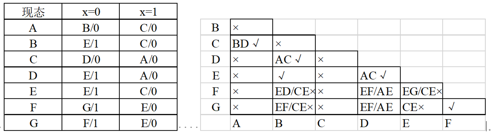
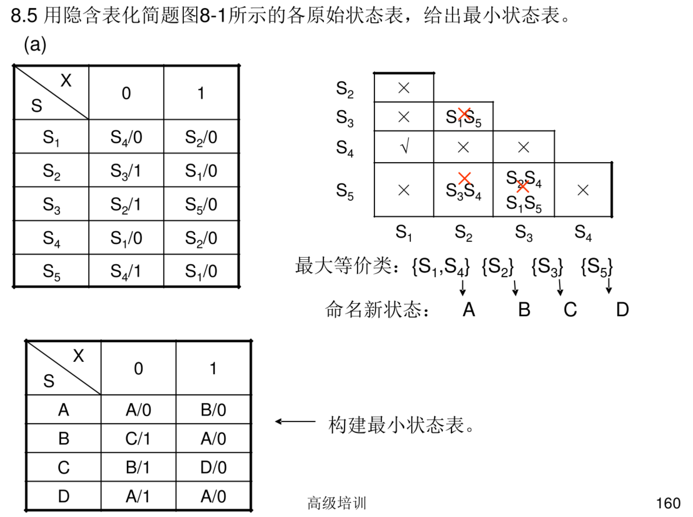
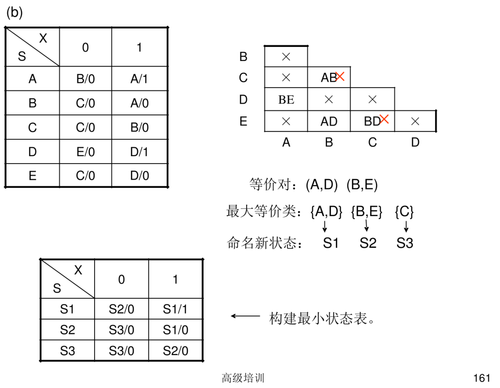
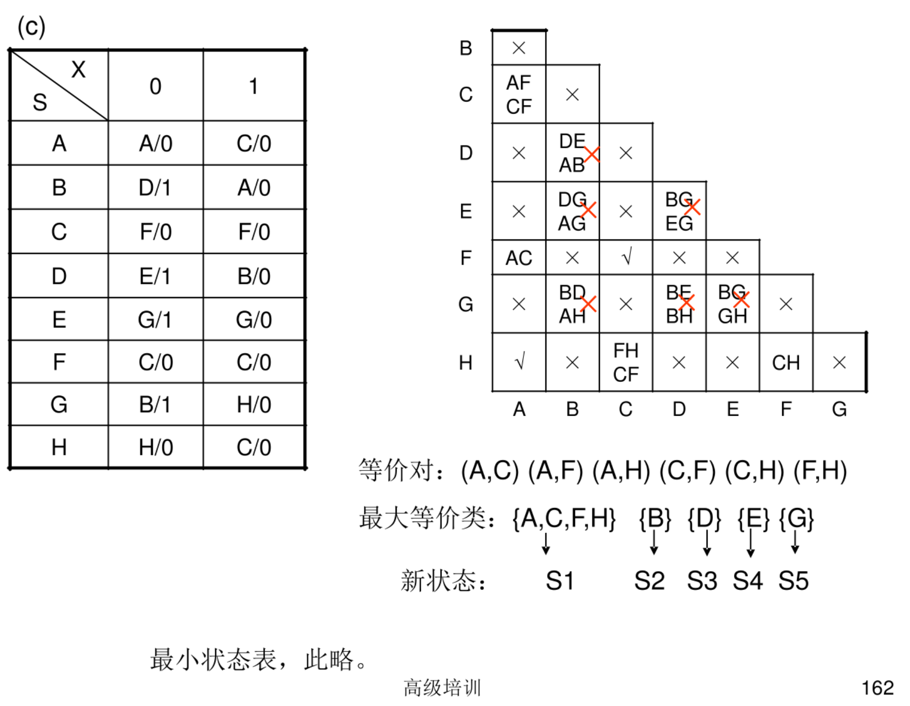

# 隐含表

$$
\text{原始状态表}\xrightarrow{\text{隐含表（化简）}}\text{最小状态表}
$$

1. **原始状态表**：列出**状态机**所有状态和输入下的输出与下一个状态的完整表格。
2. **隐含表**：用来记录哪些**状态对**之间存在不同输出或通过递推也可区分的**工具表**。
	1. 顺序比较
		1. 输出：相同
		2. 次态
			1. 次态相同
			2. 次态交错  / 次态维持
			3. 后继状态等效
			4. 次态循环
	2. 关联比较
3. **等效对**：两个在所有输入下输出和跳转都完全一致的状态对。
4. **最大等效类**：由所有彼此等效的状态组成的最大的状态集合。
5. **最小状态表**：将等效状态合并后得到的状态最少、功能相同的简化状态表。

## 25mid

> 化简原始状态表。

### 原始状态表

| S    X | 0   | 1   |
| ------ | --- | --- |
| A      | B/0 | C/0 |
| B      | E/1 | C/0 |
| C      | D/0 | A/0 |
| D      | E/1 | A/0 |
| E      | E/1 | C/0 |
| F      | G/1 | E/0 |
| G      | F/1 | E/0 |

$S_{t+1}/Z$

### 1. 隐含表

- 比较**状态对**
	1. 顺序比较
	2. 关联比较

顺序比较：

| B   | x       |                    |     |                    |                    |         |
| --- | ------- | ------------------ | --- | ------------------ | ------------------ | ------- |
| C   | BD -> 1 | x                  |     |                    |                    |         |
| D   | x       | AC -> 1            | x   |                    |                    |         |
| E   | x       | 1                  | x   | AC -> 1            |                    |         |
| F   | x       | EG -> x CE -> x | x   | EG -> x AE -> x | EG -> x CE -> x |         |
| G   | x       | EF -> x CE -> x | x   | EF -> x CE -> x | EF -> x CE -> x | FG -> 1 |
|     | A       | B                  | C   | D                  | E                  | F       |

### 2. 等效对

(A, C), (B, D), (B, E), (D, E), (F, G)

### 3. 最大等效类

求等效类，根据传递性有 (B, D), (B, E), (D, E) -> {B, D, E}

最大等效类：{B, D, E}, {A, C}, {F, G}

### 4. 最小状态表

- $S_1=\{A, C\}$
- $S_2=\{B, D, E\}$
- $S_3=\{F, G\}$

| S    X | 0       | 1       |
| ------ | ------- | ------- |
| $S_1$  | $S_2$/0 | $S_1$/0 |
| $S_2$  | $S_2$/1 | $S_1$/0 |
| $S_3$  | $S_3$/1 | $S_2$/0 |

$S_{t+1}/Z$

## e8.4-wang2-p256 (24mid)

> 化简原始状态表。

### 原始状态表

| S    X | 0   | 1   |
| ------ | --- | --- |
| A      | D/0 | B/0 |
| B      | D/0 | C/0 |
| C      | D/0 | C/1 |
| D      | D/0 | B/0 |

$S_{t+1}/Z$

### 1. 隐含表

| B   | BC -> x | x       | x   |
| --- | ------- | ------- | --- |
| C   | x       | x       | x   |
| D   | 1       | BC -> x | x   |
|     | A       | B       | C   |

- 比较**状态对**
	1. 顺序比较
	2. 关联比较

### 2. 等效对

(A, D)

### 3. 最大等效类

{A, D}, {B}, {C}

### 4. 最小状态表

- $S_1=\{A,D\}$
- $S_2=\{B\}$
- $S_3=\{C\}$

| S    X | 0       | 1       |
| ------ | ------- | ------- |
| $S_1$  | $S_1$/0 | $S_2$/0 |
| $S_2$  | $S_1$/0 | $S_3$/0 |
| $S_3$  | $S_1$/0 | $S_3$/1 |

$S_{t+1}/Z$

## e8.5-wang2-p257

> 化简原始状态表。

### 原始状态表

| S    X | 0   | 1   |
| ------ | --- | --- |
| A      | C/0 | B/1 |
| B      | F/0 | A/1 |
| C      | F/0 | G/0 |
| D      | D/1 | E/0 |
| E      | C/0 | E/1 |
| F      | C/0 | G/0 |
| G      | C/1 | D/0 |

$S_{t+1}/Z$

### 1. 隐含表

- 比较**状态对**
	1. 顺序比较
	2. 关联比较

顺序比较：

| B   | CF AB (次态循环) |          |     |          |     |     |
| --- | --------------- | -------- | --- | -------- | --- | --- |
| C   | x               | x        |     |          |     |     |
| D   | x               | x        | x   |          |     |     |
| E   | BE              | CF AE | x   | x        |     |     |
| F   | x               | x        | 1   | x        | x   |     |
| G   | x               | x        | x   | CD DE | x   | x   |
|     | A               | B        | C   | D        | E   | F   |

关联比较：

| B   | CF -> 1 AB (次态循环) |                       |     |                    |     |     |
| --- | -------------------- | --------------------- | --- | ------------------ | --- | --- |
| C   | x                    | x                     |     |                    |     |     |
| D   | x                    | x                     | x   |                    |     |     |
| E   | BE (次态循环)            | CF -> 1 AE  (次态循环) | x   | x                  |     |     |
| F   | x                    | x                     | 1   | x                  | x   |     |
| G   | x                    | x                     | x   | CD -> x DE -> x | x   | x   |
|     | A                    | B                     | C   | D                  | E   | F   |

### 2. 等效对

(A, B), (A, E), (B, E), (C, F)

### 3. 最大等效类

求等效类，根据传递性有 (A, B), (A, E), (B, E) -> {A, B, E}

最大等效类：{A, B, E}, {C, F}, {D}, {G}

### 4. 最小状态表

- $S_1=\{A, B, E\}$
- $S_2=\{C, F\}$
- $S_3=\{D\}$
- $S_4=\{G\}$

| S    X | 0       | 1       |
| ------ | ------- | ------- |
| $S_1$  | $S_2$/0 | $S_1$/1 |
| $S_2$  | $S_2$/0 | $S_4$/0 |
| $S_3$  | $S_3$/1 | $S_1$/0 |
| $S_4$  | $S_2$/1 | $S_3$/0 |

$S_{t+1}/Z$

## 8.5

