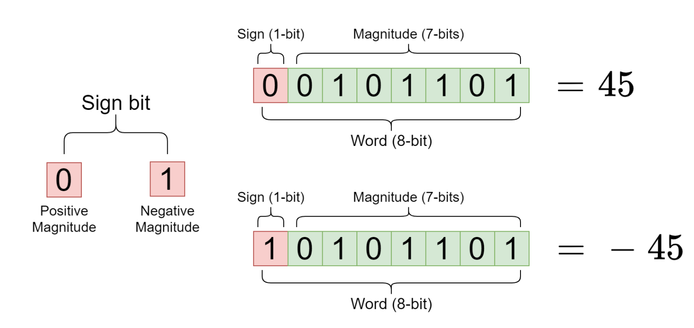
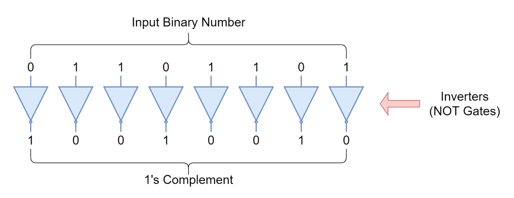
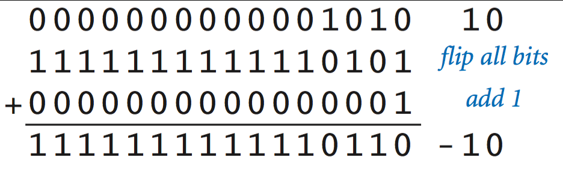

# 原反补移

| 中文术语 | 英文翻译                             | 简要说明                      |
| ---- | -------------------------------- | ------------------------- |
| 原码   | **Sign-magnitude**               | 用符号位 + 绝对值表示（符号在最高位）      |
| 反码   | **Ones' complement**             | 所有位（除符号位）取反               |
| 补码   | **Twos' complement**             | 符号位不变，反码加1，用于有符号整数的主流表示   |
| 移码   | **Offset binary** 或 **Excess-N** | 通常用于浮点数的阶码表示，如 Excess-127 |

## Sign-magnitude | 原码

```
0+1-
```

([img src](https://www.electronics-lab.com/article/signed-binary-numbers/))

## Ones' complement | 反码



([img src](https://www.electronics-lab.com/article/signed-binary-numbers/))

## 2's complement




