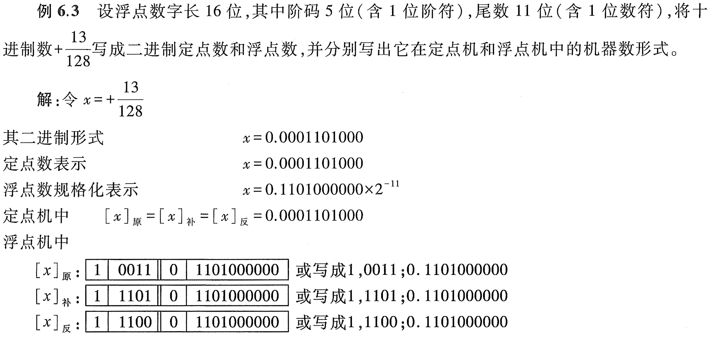

# e6.3-tang3-p231



## sol

**分数（十进制数） -> 二进制（定点 / 浮点规格化） -> 机器数（定点机 / 浮点机）**

---

- 浮点数字长
	- 阶码
		- 阶符
		- 阶码的数值部分
	- 尾数
		- 数符
		- 尾数的数值部分

```
阶符,阶码的数值部分;数符.尾数的数值部分
```

---

$x=+\frac{13}{128}$

d'13 = 8 + 4 + 1 = b'1101

128 = $2^7$

除以128，等同于小数点左移7位

**定点数表示**

浮点数规格化表示：小数点后的第1位是1。在本题中，需要小数点再往右移动3位（扩大$2^3$倍），则原数需要缩小$2^3$倍，即$\times 2^{-11}$，这里的11是二进制的3。

在定点机中，正数的原反补相同。

在浮点机中，按照固定格式来书写：

| x   | 阶符  | 阶码的数值部分 | 数符  | 尾数的数值部分    |
| --- | --- | ------- | --- | ---------- |
| 原   | 1   | 0011    | 0   | 1101000000 |
| 补   | 1   | 1101    | 0   | 1101000000 |
| 反   | 1   | 1100    | 0   | 1101000000 |
