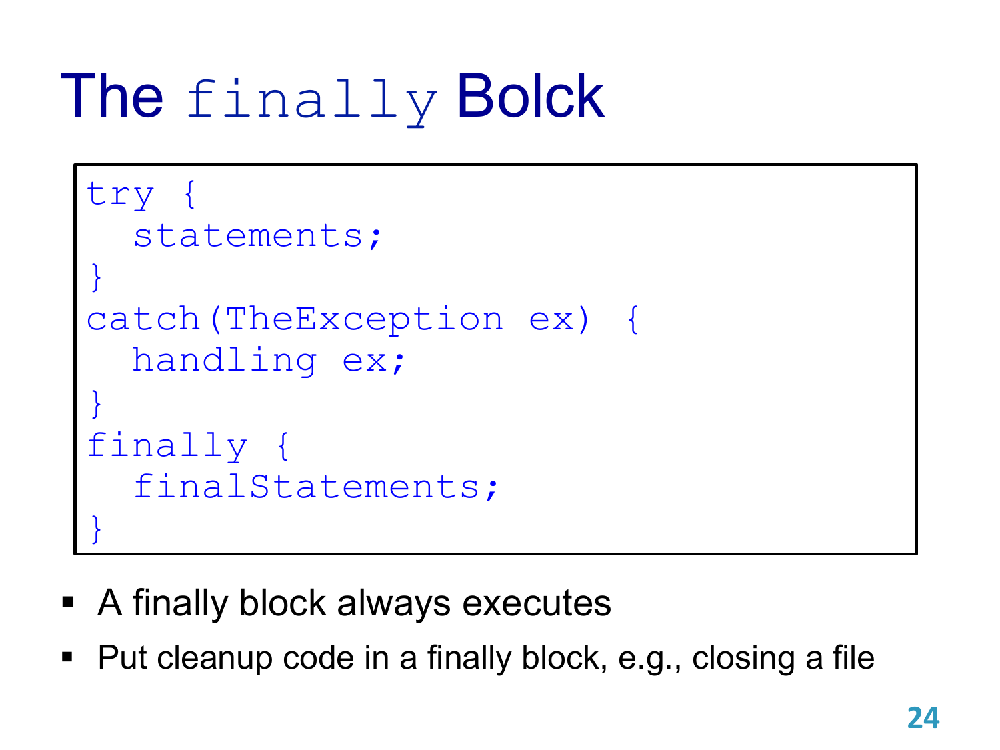

# Exceptions

## Handling Exceptions

```java
try {
	codes to try;
	possibly throw an exception;
	more codes;
} catch (ExceptionClassName exception) {
	process;
}
```

```java
throw new ExceptionClassName(optArguments);
```

```java
try {
	statements;
} catch (Exception ex) {
	handling ex;
} finally {
	final statements;
}

statements;
```

## The Java Exception Hierarchy


## Checked Exceptions vs. Unchecked Exceptions


### Unchecked Exceptions


### The finally Bolck



