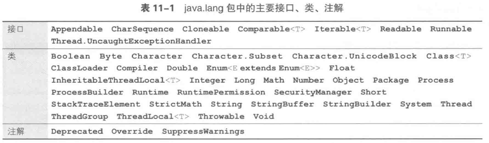

# Package

- 

## 术语

| 中文       | 英文                                |
| -------- | --------------------------------- |
| 简名       | simple name                       |
| 完全限定名    | fully qualified name              |
| 类型导入声明   | type import declaration           |
| 单类型导入声明  | single-type-import declaration    |
| 按需类型导入声明 | type-import-on-demand declaration |

## refs

- 柴田望洋. 明解Java[M]. 北京: 人民邮电出版社, 2018: 331–346.