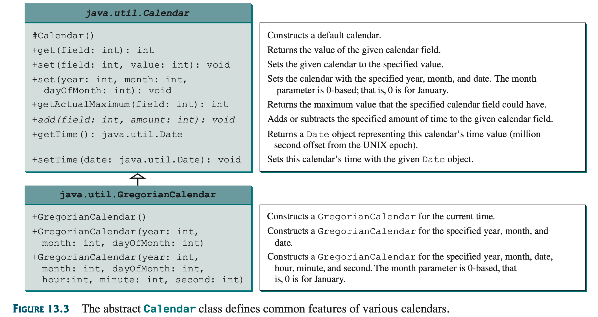
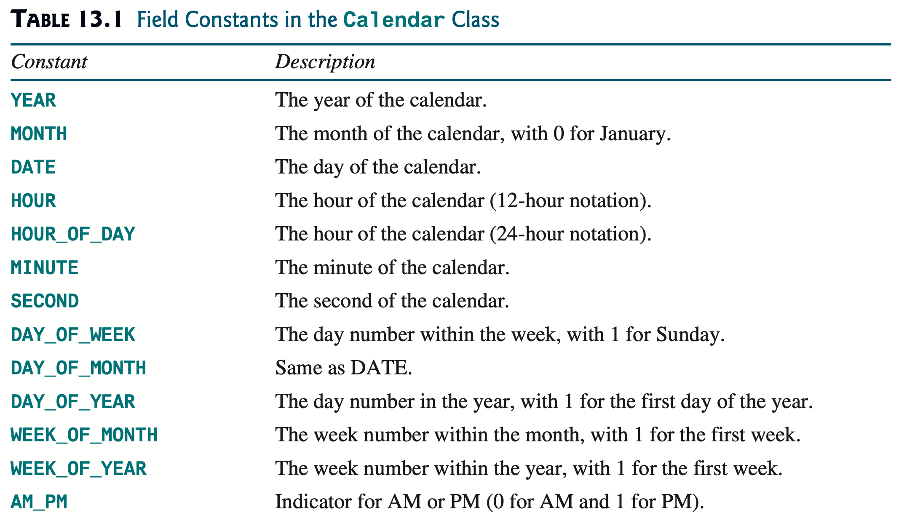
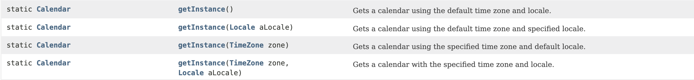
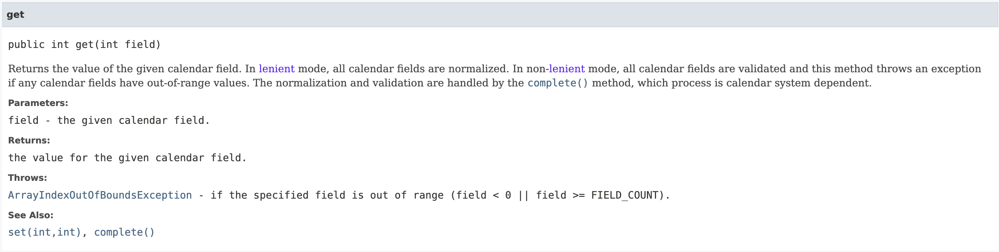

# Calendar



## constants



## getInstance

```java
Calendar cal = Calendar.getInstance();
```



## get



```java
int year = cal.get(Calendar.YEAR);
int month = cal.get(Calendar.MONTH) + 1; // 0 for January
int day = cal.get(Calendar.DATE);
```

