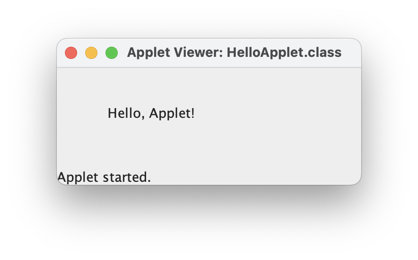

---
tags:
  - sdkman
  - applet
---

# Hello Applet

## introduction

Java 的 **Applet** 是为了**解决早期网页中缺乏跨平台、交互性强的动态内容**这一问题而提出的。具体来说：

### background

在 1990 年代早期：

- 网页内容主要是静态的（HTML + 图片），缺乏交互性。
    
- 不同平台上的程序不兼容，Web 程序难以“跨平台运行”。
    
- 浏览器功能有限，无法直接运行复杂逻辑或图形程序。
    

### why Applet?

Java Applet 的设计初衷是为了：

1. **提供跨平台的交互式网页内容**：Java 的“**一次编写，到处运行**”特性使得 Applet 可以嵌入网页，在不同操作系统和浏览器中运行。
    
2. **增强网页的动态效果和图形交互**：Applet 可以实现动画、图表、游戏、计算工具等，远比 HTML 强大。
    
3. **客户端运行程序**：避免服务器端负担，把计算任务转移到用户浏览器中。
    

### summary

**Applet 是为了解决网页缺乏交互性和平台兼容性的问题，通过 Java 技术将可执行程序嵌入网页，实现动态、跨平台的 Web 应用。**

> 不过由于安全性差、启动慢以及现代技术（JavaScript、HTML5、WebAssembly）的替代，**Applet 已被淘汰**。

Java Applet 已于 JDK 9 起标记为废弃，JDK 11 之后被完全移除。

## HelloApplet

本例适用于 JDK 8 或更早版本，**不推荐用于现代开发**，仅用于了解历史技术。

```java
// HelloApplet.java

import java.applet.Applet;
import java.awt.Graphics;

/*
<applet code="HelloApplet.class" width="300" height="100"></applet>
*/

public class HelloApplet extends Applet {
	public void paint(Graphics g) {
		g.drawString("Hello, Applet!", 50, 50);
	}
}
```

- `paint(Graphics g)` 是 Applet 的主要绘图函数。
    
- `g.drawString(...)` 用于在窗口上绘制字符串。
    
- `code="HelloApplet.class"` 指定要加载的 Applet 类。


```html
<!-- HelloApplet.html -->

<!DOCTYPE html>
<html>
<head>
    <title>Hello Applet</title>
</head>
<body>
    <h3>Java Applet Demo:</h3>
    <applet code="HelloApplet.class" width="300" height="100">
        Your browser does not support Java Applets.
    </applet>
</body>
</html>
```

可以把 Applet 当作普通 Java 程序来运行，**通过 `AppletViewer` 工具或封装为 JFrame 运行**。

### `AppletViewer`（Java 8）

> ⚠️ 需要安装 Oracle JDK 8 或 OpenJDK 8。

1. 安装 Java 8（建议用 **SDKMAN** 或 AdoptOpenJDK）；
2. 编写 `HelloApplet.java`；
3. 创建 HTML 文件 `HelloApplet.html`；
4. 编译并使用 `appletviewer` 运行。

```shell
javac HelloApplet.java
appletviewer hello.html
```


