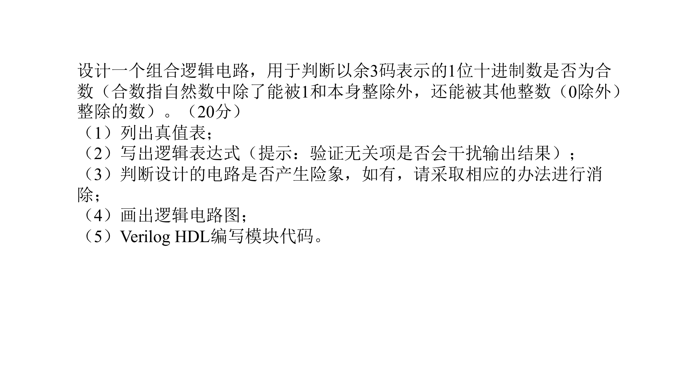

# P2 组合电路的设计

## Ex. 1

> 设计1个检测输入8421码的是否为偶数电路，当出现偶数时，电路输出1，否则为0。

设四个输出数据分别为 B3 B2 B1 B0，输出为 F

### 1. 真值表

| $B_3B_2B_1B_0$ | $F$   |       |        |
| -------------- | ----- | ----- | ------ |
| 0000           | d     |       | 0      |
| 0001           | d     |       | 1      |
| 0010           | d     |       | 2      |
| 0011           | 0     | 0     | 3      |
| 0100           | 0     | 1     | 4      |
| 0101           | 0     | 2     | 5      |
| 0110           | 0     | 3     | 6      |
| **0111**       | **1** | **4** | **7**  |
| 1000           | 0     | 5     | 8      |
| **1001**       | **1** | **6** | **9**  |
| 1010           | 0     | 7     | 10     |
| **1011**       | **1** | **8** | **11** |
| **1100**       | **1** | **9** | **12** |
| 1101           | d     |       | 13     |
| 1110           | d     |       | 14     |
| 1111           | d     |       | 15     |

### 2. 表达式

$F(B_3,B_2,B_1,B_0)=\sum m(7,9,11,12)+\sum d(0,1,2,13,14,15)$

无关项会干扰输出结果，因此表达式化简时不能考虑无关项，因此表达式为：

$F(B_3,B_2,B_1,B_0)=B_3'B_2B_1B_0+B_3B_2'B_1'B_0+B_3B_2'B_1B_0+B_3B_2B_1'B_0'$

### 3. 卡诺图

### 4. 电路图

---

