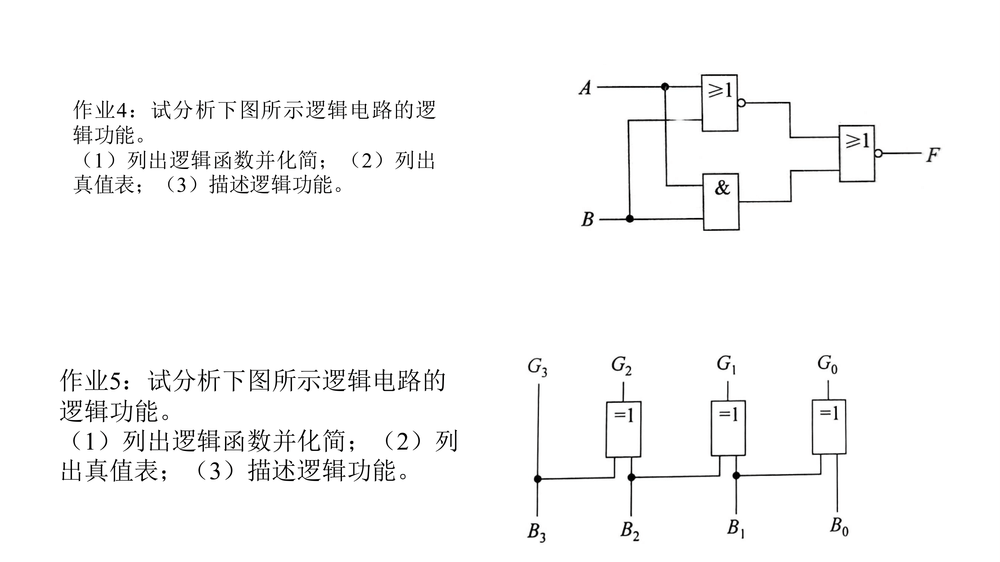
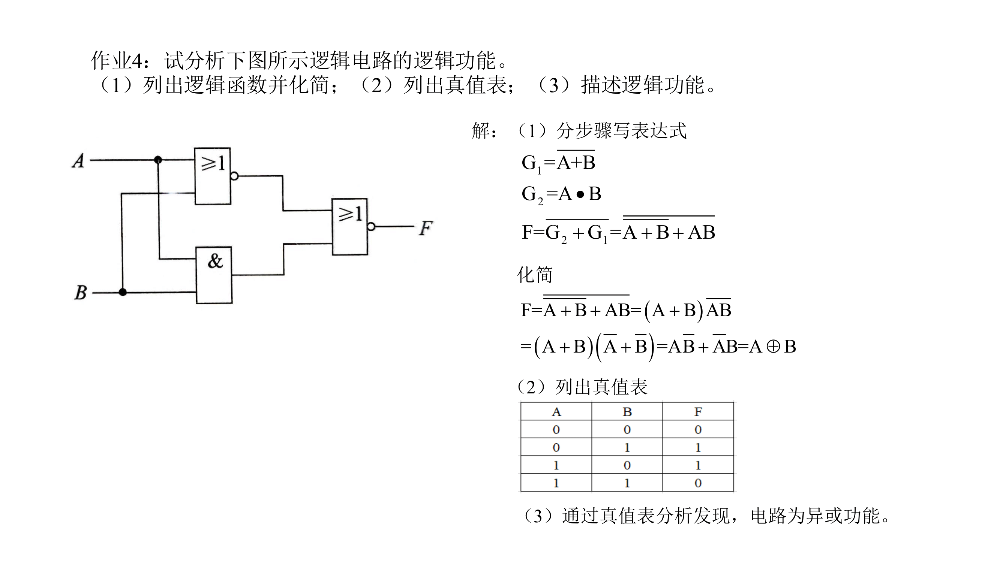
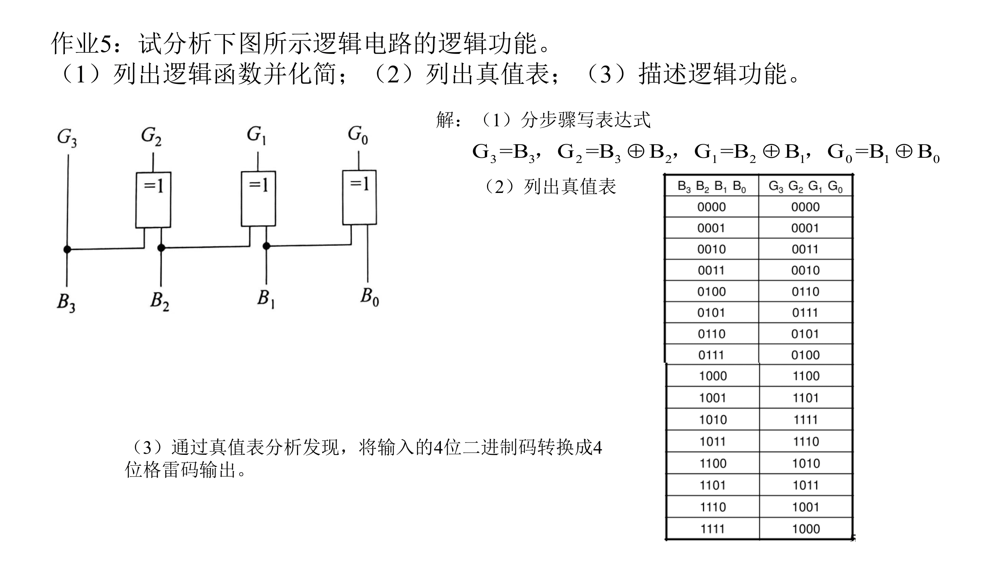

# P1 组合电路的分析

## Ex. 1 

> **请分析下图所示的组合逻辑电路，并完成以下任务：**
> 
> 1. 写出电路对应的函数表达式，并进行化简；
> 2. 绘制该电路的真值表；
> 3. 用文字简要说明该电路实现的逻辑功能。

### 1. 分步骤写出函数表达式并化简

$G_1=(A+B)'$

$G_2=AB$

$$
\begin{aligned}
F &= (G_1+G_2)' \\
  &= ((A+B)'+AB)' \\
  &= (A+B)(AB)' \\
  &= (A+B)(A'+B') \\
  & = AA' + AB' + A'B + BB' \\
  & = 0 + AB' + A'B + 0 \\
  & = AB' + A'B \\
  & = A\oplus B
\end{aligned}
$$

### 2. 绘制真值表

| A   | B   | F   |
| --- | --- | --- |
| 0   | 0   | 0   |
| 0   | 1   | 1   |
| 1   | 0   | 1   |
| 1   | 1   | 0   |

### 3. 分析逻辑功能

经分析，电路功能为**异或**。
## Ex. 2

> **请分析下图所示的组合逻辑电路，并完成以下任务：**
> 
> 1. 写出电路对应的函数表达式，并进行化简；
> 2. 绘制该电路的真值表；
> 3. 用文字简要说明该电路实现的逻辑功能。

### 1. 分步骤写出函数表达式并化简

$G_3=B_3$

$G_2=B_3\oplus B_2$

$G_1=B_2\oplus B_1$

$G_0 = B_1\oplus B_0$

### 2. 绘制真值表

| $B_3B_2B_1B_0$ | $G_3G_2G_1G_0$ |
| -------------- | -------------- |
| 0000           | 0000           |
| 0001           | 0001           |
| 0010           | 0011           |
| 0011           | 0010           |
| 0100           | 0110           |
| 0101           | 0111           |
| 0110           | 0101           |
| 0111           | 0100           |
| 1000           | 1100           |
| 1001           | 1101           |
| 1010           | 1111           |
| 1011           | 1110           |
| 1100           | 1010           |
| 1101           | 1011           |
| 1110           | 1001           |
| 1111           | 1000           |
### 3. 分析逻辑功能

经分析，电路功能为**将输入的二进制码转换成4位格雷码输出**。

