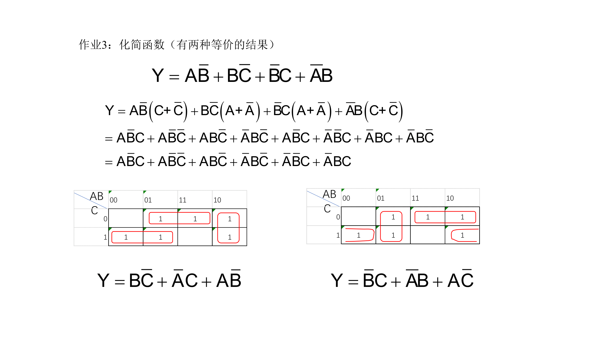

# P2 逻辑函数化简

## Ex. 1

> $F(A,B,C)=A'B'+AC+B'C$

$$
\begin{aligned}
F(A,B,C)= &= A'B'+AC \\
\end{aligned}
$$

#todo 包含律

## Ex. 2

> $Y=AB'+BC'+B'C+A'B$

$$
\begin{aligned}
Y &= AB'(C+C') + BC'(A+A') + B'C(A+A') + A'B(C+C') \\
  &= AB'C+AB'C'+ABC'+A'BC'+AB'C+A'B'C+A'BC+A'BC' \\
  &= \textcolor{blue}{101}+100+110+\textcolor{red}{010}+\textcolor{blue}{101}+001+011+\textcolor{red}{010} \\
\end{aligned}
$$

$Y=\overline{A}B+A\overline{C}+\overline{B}C$

| A   | B   | C   | Output |
| --- | --- | --- | ------ |
| 0   | 0   | 0   | F      |
| 0   | 0   | 1   | T      |
| 0   | 1   | 0   | T      |
| 0   | 1   | 1   | T      |
| 1   | 0   | 0   | T      |
| 1   | 0   | 1   | T      |
| 1   | 1   | 0   | T      |
| 1   | 1   | 1   | F      |
